# 为什么每个初学前端开发的人都应该知道发布-订阅模式？

> 原文：<https://itnext.io/why-every-beginner-front-end-developer-should-know-publish-subscribe-pattern-72a12cd68d44?source=collection_archive---------0----------------------->

## AKA:如何以一种不那么痛苦的方式理解异步 JS 代码。

当你发现自己处于 web 开发旅程中最激动人心的时刻时，一切都开始了:将你的注意力从样式、美学和网格系统转移到逻辑、框架和编写 JavaScript 代码的时刻。

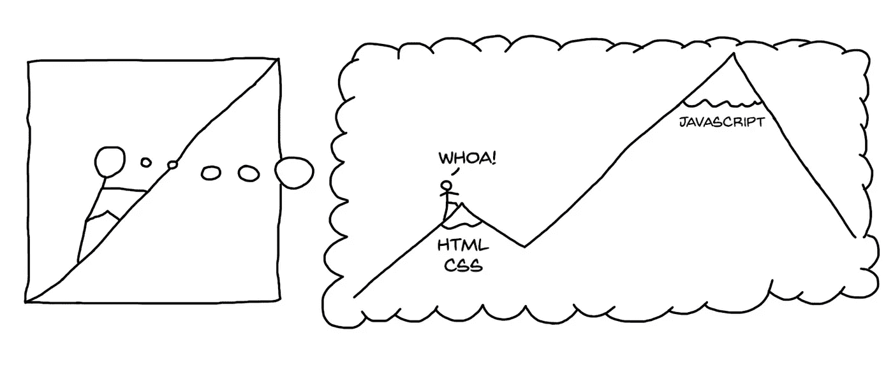

它是这样开始的…

此时此刻，您开始看到，当谈到 JS 时，它不仅仅是几个简单的 jQuery 技巧和视觉效果。你看到了自己创建网络应用**的大画面——不仅仅是网页。**

**当你在创建 JS 代码上投入了越来越多的精力时，你开始考虑交互性、子系统和逻辑。事情开始运转，最后，你感觉到你的应用程序充满活力。一个全新的、激动人心的世界呈现在你面前。随之而来的是许多新的大问题。**

**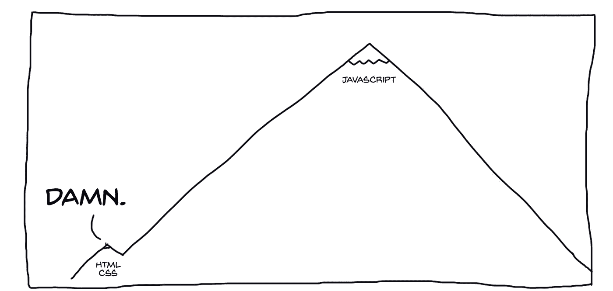**

**…最后变成这样。而且还不是结束！**

**但是你没有气馁——新的想法不断涌现，你编写了越来越多的代码。来自某篇博文的各种技术正在被测试，解决问题的各种方法正在被修补。**

**然后，你开始觉得有点痒。**

**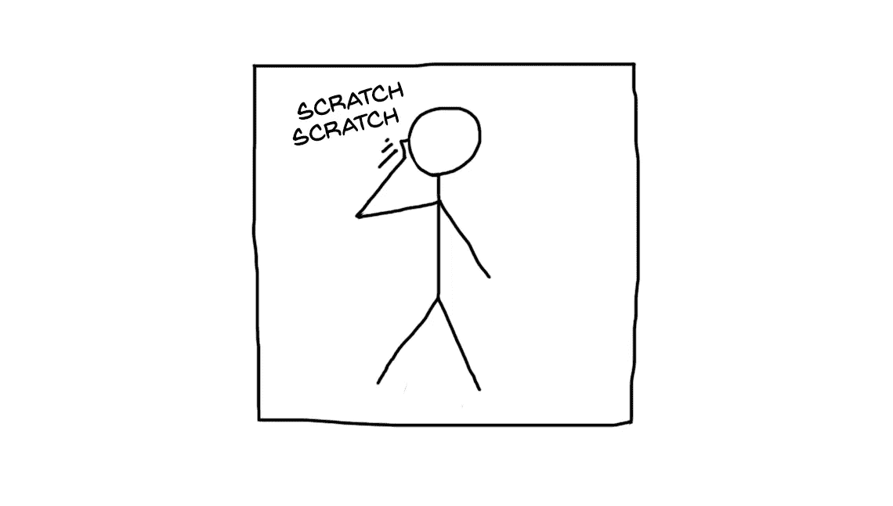**

**您的`script.js`文件变大。一小时前它有 200 行代码，现在它超过了 500 行。*【嘿】* —你以为——*“没什么大不了的”*。您已经了解了干净和可维护的代码——为了实现这一点，您开始将您的逻辑分成文件、块和组件。事情又开始变得美好了。一切都被整齐地分类，就像在一个精心组织的图书馆里。你感觉不错，因为各种文件都被**命名为** **妥善****放置** **在某个目录**。代码变得模块化，更易于维护。**

**不知从哪里，你开始感觉到另一个痒来了——但是原因还不清楚。**

**Web 应用程序的行为很少是线性的。事实上，任何 web 应用程序中的许多操作都应该是突然发生的(有时甚至是出乎意料或自发的)。**

**应用程序需要正确地响应网络事件、用户交互、定时机制和各种延迟动作。不知从哪里冒出来的，名为“异步性”和“竞争条件”的丑陋怪物正在敲你的门。**

**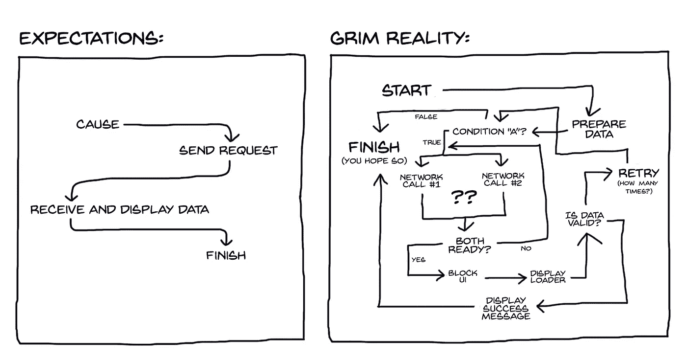**

**你需要让你英俊的模块化结构和丑陋的新娘结婚——异步代码。然后痒就明显了。一个困难的问题开始出现:我到底应该把这段代码放在这里？**

**你可能会把你的应用程序漂亮地分成几块积木。导航和内容组件可以整齐地放置在适当的目录中，较小的助手脚本文件可以包含执行普通任务的重复代码。一切都可以通过单条目`app.js`代码文件来管理，一切都从这里开始。干净利落。**

**但是你的目标是在**应用**的一个部分中调用异步代码，**处理它并将其发送到另一个部分**。**

**异步代码应该放在 UI 组件中吗？还是在主文件里？您的应用程序的哪个构建模块应该负责处理反应？加工哪一个？错误处理呢？你在脑海中测试了各种方法——但你的不安感不会消失——你意识到这样一个事实，如果你想扩展和缩放这个代码，它会变得越来越难。痒还没有消失。你需要找到一些理想的，通用的解决方案。**

> **放松，这不是你的问题。其实你的思维越结构化，这种痒感就会越强烈。**

**你开始阅读关于处理这个问题的文章，并寻找现成的解决方案。在第一个瞬间，你读到了承诺相对于回电的优势。接下来的一个小时，你发现自己试图理解什么是 RxJS(以及为什么网上某个随机的家伙说它是开发网络的人类唯一合法的救赎)。读了一些之后，你会试着理解，为什么一个博主写道没有 T2 的 T1 毫无意义，但是另一个博主对 T3 有同样的想法。**

**一天下来，你疼痛的脑袋里充满了各种各样的时髦词汇。你的大脑从大量可能的方法中爆发出来。那么，为什么会有这么多呢？不应该很简单吗？人们真的喜欢在网上争论，而不是发展一个好的模式吗？**

**因为这个话题并不简单。**

> ****不管使用什么样的框架，异步代码的正确排列不是也永远不会是简单明了的。没有单一的、通用的、确定的解决方案。这在很大程度上取决于需求、环境、预期结果和许多其他因素。****

**同样，这个故事也不会提供一个解决所有问题的解决方案。但是它有望让您更容易地想到异步代码——因为它都基于一个非常基本的原则。**

## **通用零件**

**从某种角度来看，编程语言的结构并不复杂。毕竟，它们只是一个愚蠢的类似计算器的机器，能够在各种盒子中存储值，并由于一些`ifs`或函数调用而改变其流程。作为一种命令式的、稍微面向对象的语言，JavaScript 在这里并没有什么不同。**

**这意味着在引擎盖下，来自银河系各个点的所有宇宙异步装置(无论是 redux-saga、RxJS、observables 还是无数其他变种人)都必须依赖相同的基本原理。他们的魔法并不那么神奇——它必须建立在众所周知的基础上，在较低的层面上没有什么新的发明。**

**为什么这个事实如此重要？让我们想一个例子。**

## **让我们做(和打破)一些东西**

**考虑一个简单的应用程序，一个非常简单的应用程序。例如，一个在地图上标记我们最喜欢的地方的小应用程序。没有什么特别的:右边是地图视图，左边是简单的侧边栏。点击地图应该会在地图上保存一个新的标记。**

****

**当然，我们有点雄心勃勃，我们将做出额外的功能:我们希望它记住使用本地存储的位置列表。**

**现在，基于这个描述，我们可以为我们的应用程序绘制一些基本的动作流程图:**

****

**如你所见，这并不复杂。**

> **为了简洁起见，下面的例子将在不使用任何框架或 UI 库的情况下编写——只涉及普通的 JavaScript。此外，我们将使用谷歌地图 API 的一小部分——如果你想自己创建类似的应用程序，你应该在[https://cloud.google.com/maps-platform/#get-started](https://cloud.google.com/maps-platform/#get-started)上注册你的 API 密钥。**

**好了，让我们开始编码并创建一个快速原型:**

**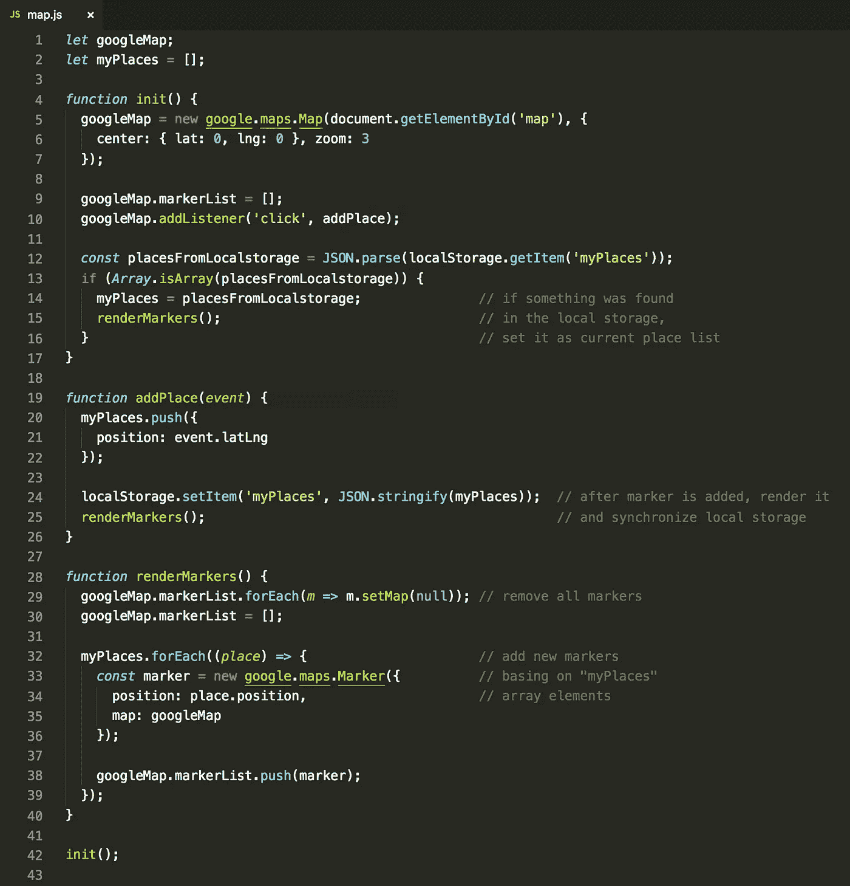**

**让我们快速分析一下这个:**

*   **`init()`函数使用 Google Maps API 初始化地图元素，设置地图点击动作，然后尝试从本地存储加载标记。**
*   **`addPlace()`处理地图点击——然后向列表中添加新地点并调用标记渲染。**
*   **`renderMarkers()`遍历数组中的位置，清除地图后，在上面放置标记。**

**让我们把一些不完美放在一边(猴子补丁，没有错误处理等等。)—作为原型，它将足够好。干净利落。让我们为此构建一些标记:**

**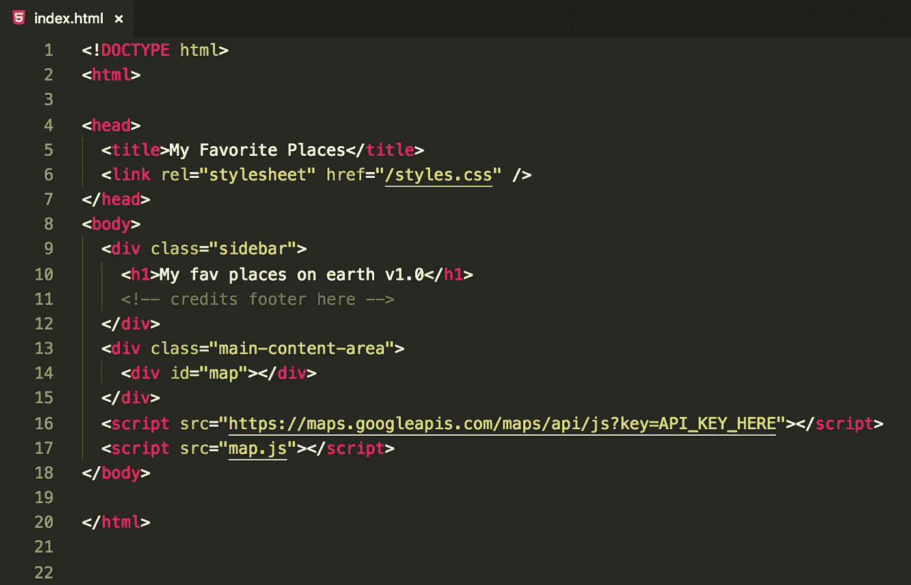**

**假设我们附加了一些样式(我们不会在这里讨论它，因为它不相关)，信不信由你——它实际上*完成了它的工作:***

**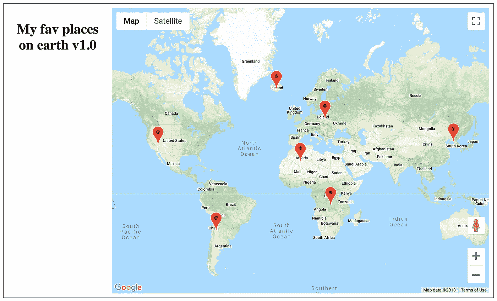**

**虽然很丑，但是很好用**。但是不可扩展*。*** 啊哈。**

**首先，我们在这里混淆了责任。如果你听说过可靠的原则，你应该已经知道我们已经违反了其中的第一条:T2 单一责任原则。在我们的例子中——尽管很简单——一个代码文件负责**和**处理用户动作和数据及其同步。不应该。为什么？*“嘿，有用吧？”你可能会说。的确如此，但是在后续功能方面很难维护。***

**让我用另一种方式来说服你。想象一下，我们将扩展我们的应用程序，并在其中添加新功能:**

****

**首先，我们希望在侧边栏中有一个标记位置的列表。第二，我们想通过 Google API 查找城市名称——这就是引入异步机制的地方。**

**好的，那么我们的新流程图将具有以下形状:**

**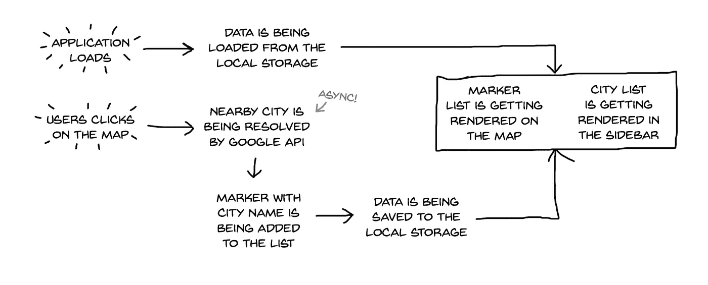**

***注意:城市名称查找不是火箭科学，谷歌地图为此提供了非常简单的 API。* [*你可以自己去看看！*](https://developers.google.com/maps/documentation/geocoding/intro#ReverseGeocoding)**

**从 Google API 获取城市名有一个特点:**不是即时的**。它需要在 Google 的 JavaScript 库中调用适当的服务，需要一些时间才能得到响应。这将导致一点复杂——但肯定是一个教育问题。**

**让我们回到 UI，试着注意一件明显的事情。有两个独立的界面区域:侧边栏和主要内容区域。我们绝对**不应该**写一大段代码来处理这两者。原因是显而易见的——如果未来我们将有四个组件呢？还是六个？还是 100？我们需要将我们的代码分成几块——这样，我们将有两个独立的 JavaScript 文件。一个用于工具条，另一个用于地图。问题是——哪一个应该保存位置数组？**

**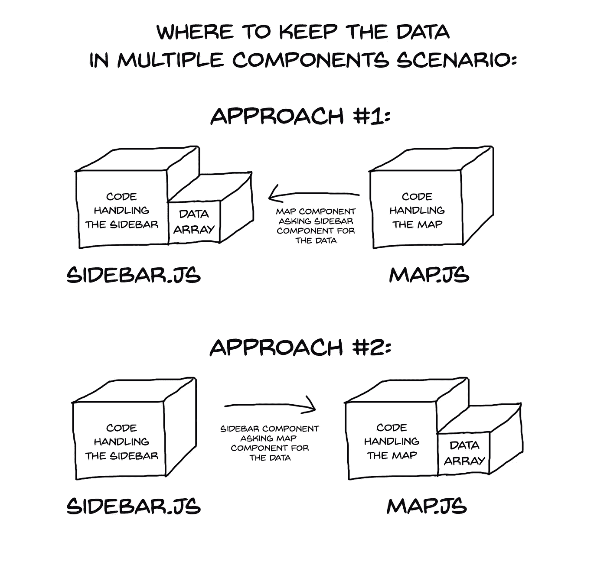**

**这里哪种方法是正确的？一号还是二号？嗯，答案是:**都不是**。还记得单一责任原则吗？为了保持整洁和模块化(以及酷)，我们应该以某种方式分离关注点，并将我们的数据逻辑放在其他地方。请看:**

**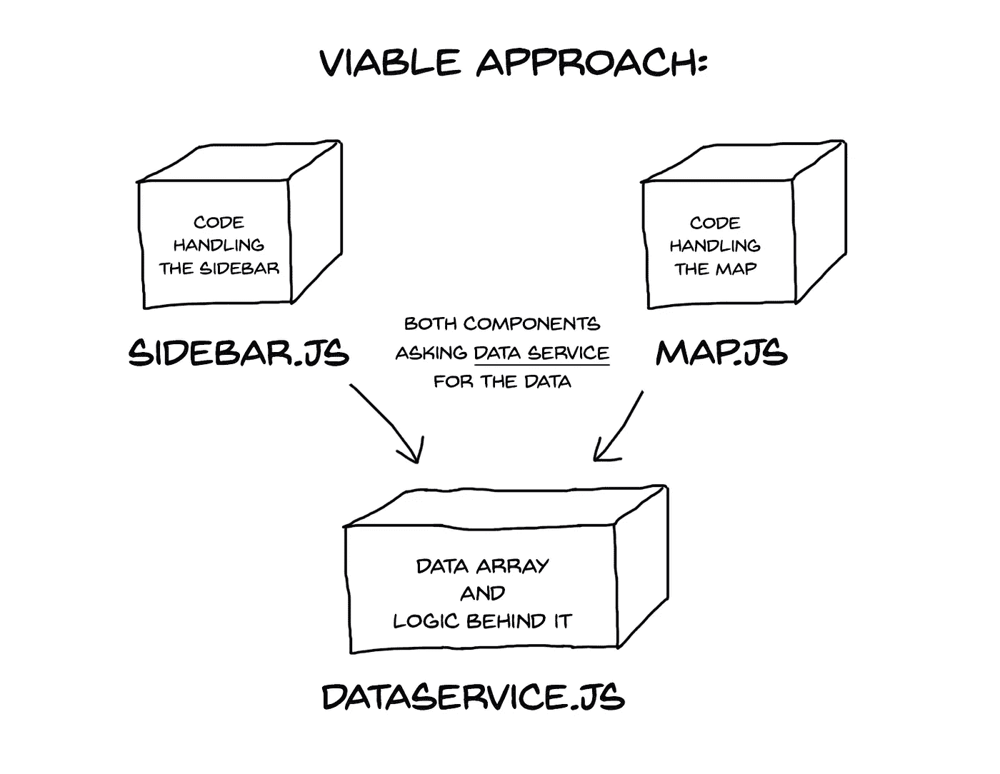**

**代码分离的圣杯:我们可以将存储和逻辑移到另一个代码文件中，由它来集中处理数据。这个文件——服务——将负责这些问题和机制，比如与本地存储同步。相反，组件将只作为接口部件。它应该是坚固的。让我们试着介绍一下这种模式:**

****服务代码:****

**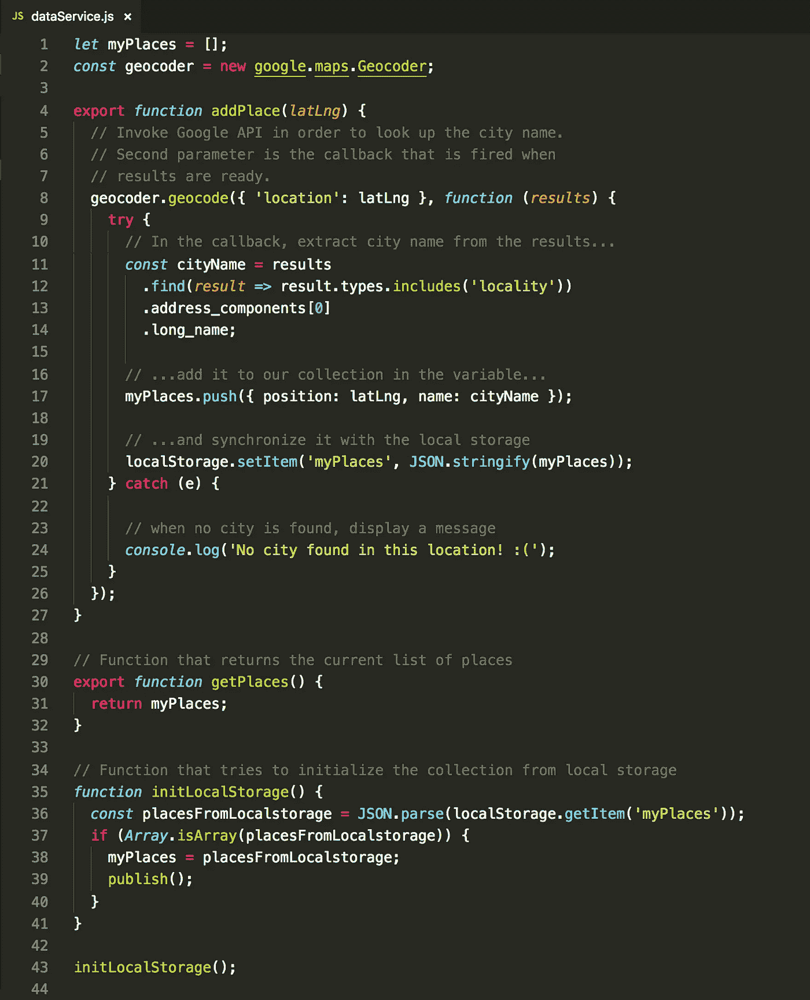**

****地图组件编码:****

**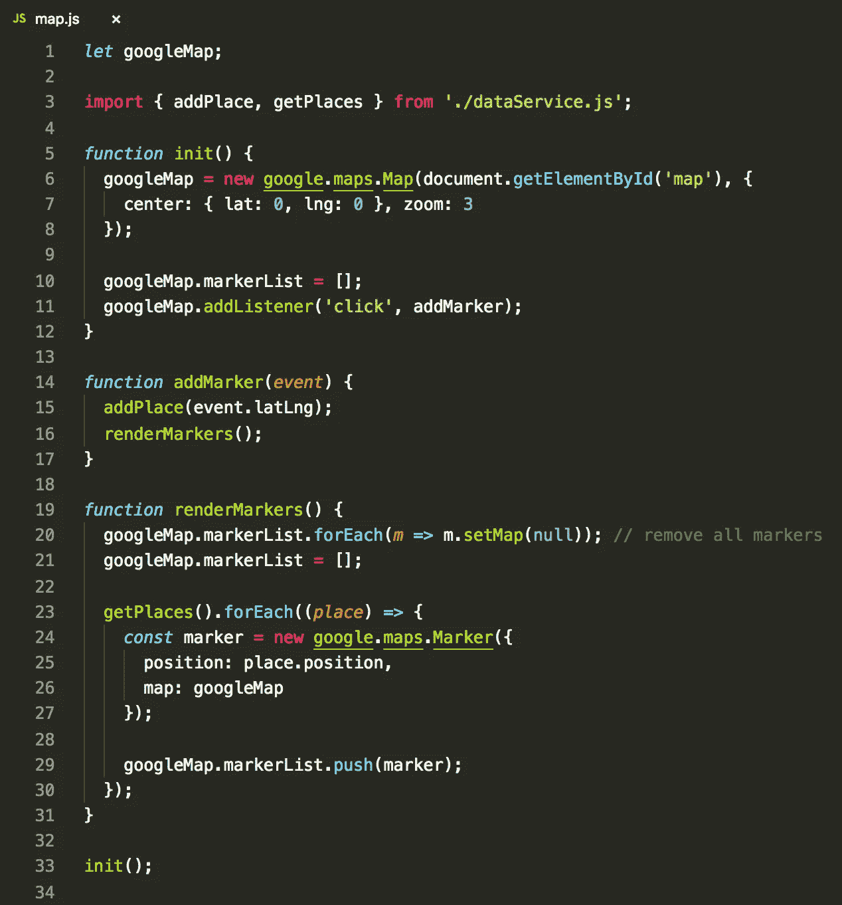**

****侧边栏组件代码:****

**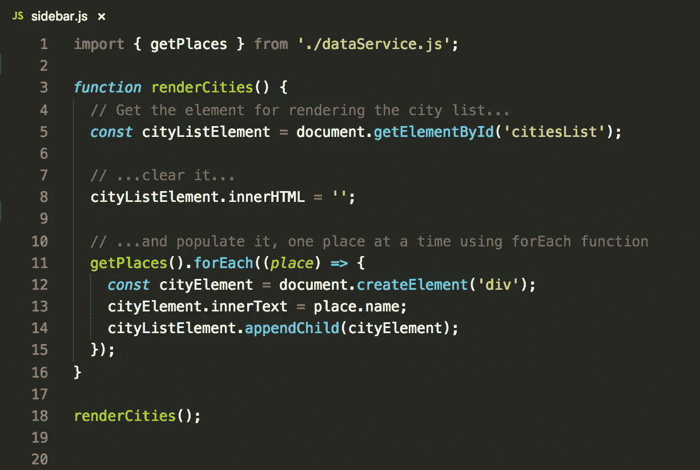**

**很大程度上痒已经消失了。代码再次被整齐地组织在适当的抽屉里。但是在我们再次感觉良好之前，让我们来运行这个。**

**……哎呀。 *做任何动作后，界面没有反应。***

**为什么？嗯，我们没有实现任何方式的同步。在使用导入的方法添加一个位置后，我们在任何地方都不会收到关于它的信号。我们甚至不能在调用`addPlace()`后将`getPlaces()`方法放在下一行，因为城市查找是异步的，需要时间来完成。**

**事情在后台发生，但是我们的界面不知道它的结果——在地图上添加标记后，我们在侧边栏中看不到变化。怎么解决？**

**一个非常简单的想法是偶尔轮询一下我们的服务——例如，每个组件每秒都可以从服务中获取项目。例如:**

****

**有用吗？起伏不定，但没错。但这是最优的吗？一点也不——我们在应用程序的事件循环中充斥着在大多数情况下不会有任何效果的动作。**

**毕竟，你不会每小时都去当地邮局查看包裹是否到达。同样，如果你要离开我们的车去修理，你不会每半小时就打电话给机械师问工作是否完成了(至少希望你不是这种人)。相反，我们在等一个电话。当工作准备好了，技工怎么知道该给谁打电话？傻——当然，我们给他留了联系方式。**

**现在，让我们尝试在 JavaScript 中模仿“留下我们的联系方式”。**

**JavaScript 是一种非常奇特的语言——它的一个古怪特性是将函数视为任何其他值。用形式化的描述，“职能是一等公民”。这意味着任何函数都可以赋给一个变量，或者作为参数传递给另一个函数。你已经知道这个机制了:还记得`setTimeout`、`setInterval`和各种事件监听器回调吗？它们通过使用函数作为参数来工作。**

****这是异步场景中的基本特征。****

**我们可以定义一个函数来更新我们的 UI——然后将它传递给代码的另一部分，在那里调用它。**

**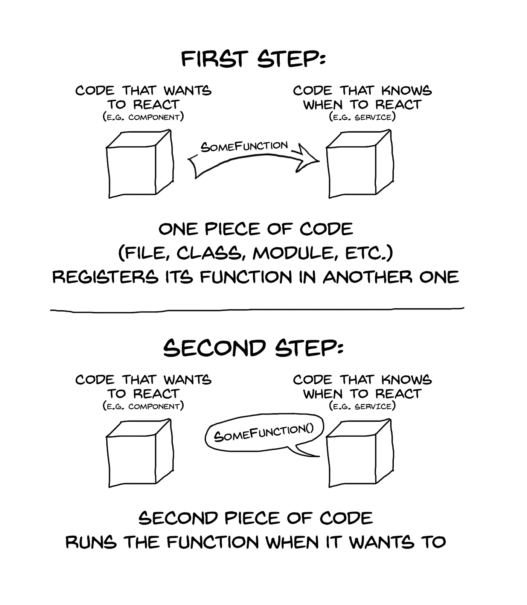**

**使用这种机制，我们可以将我们的`renderCities`传递给那里的`dataService.`,它将在必要时被调用:毕竟，服务精确地知道数据何时应该被传输到组件——而不是相反。**

**我们试试吧！我们将从在服务端增加记忆功能开始，然后在某个时刻调用它。**

**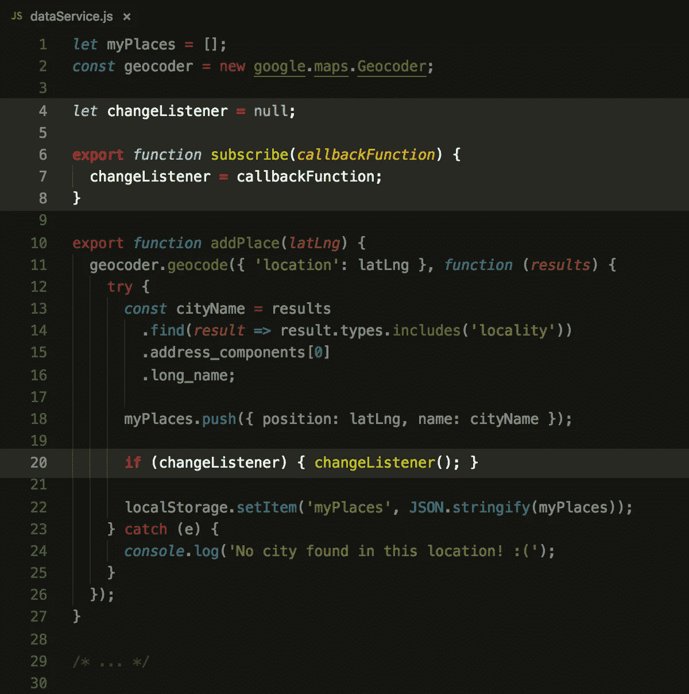**

**现在，让我们将它附加到侧边栏:**

**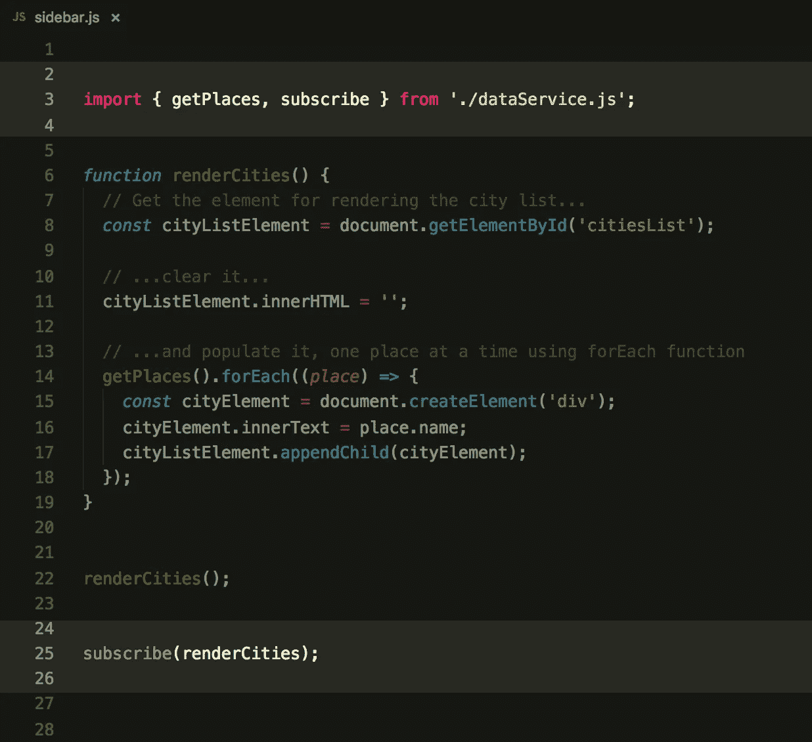**

**你看到这里发生了什么吗？当我们的侧边栏代码被加载时，**在** `**dataService**`中注册 `**renderCities**` **函数。****

**然后，`**dataService**`在需要的时候调用这个函数——在本例中，当我们的数据发生变化时**(由于`addPlace()`调用)。****

**确切地说:我们代码的一部分是事件的**订阅者**(侧栏组件)，另一部分是**发布者**(服务方法)。Boom，我们已经实现了发布-订阅模式的最基本形式，这是几乎所有高级异步概念的基本概念。**

**还有什么呢？**

**请注意，使用这段代码，我们将自己限制为只有一个监听组件(或者换句话说，只有一个订阅者)。如果使用`subscribe()`函数传递任何其他函数，它将覆盖当前的`changeListener`。为了解决这个问题，我们可以设置一组监听器:**

**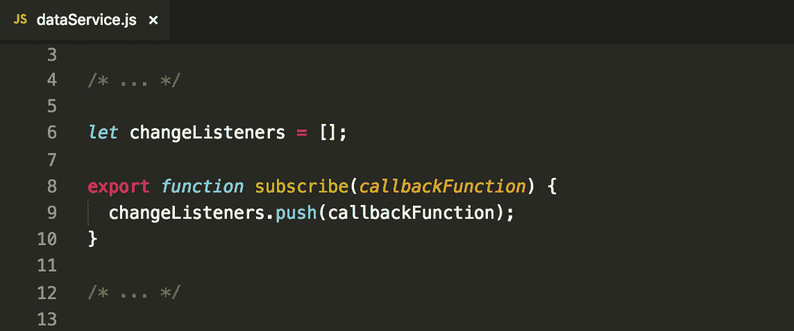**

**现在，我们可以稍微整理一下代码，编写一个为我们调用所有侦听器的函数:**

**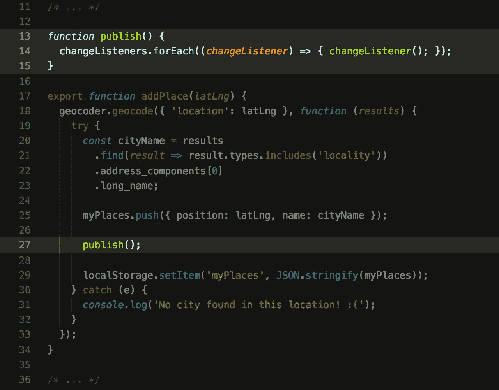**

**这样，我们还可以连接`map.js`组件，这样它将对服务中的所有操作做出正确的反应:**

**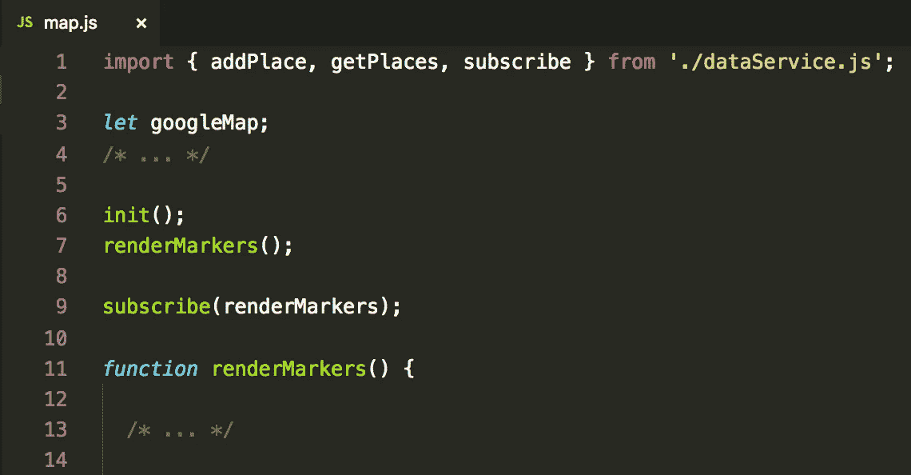**

**使用订阅者作为传输数据的方法怎么样？这样，我们可以直接使用*监听器的参数*得到标记。像这样:**

**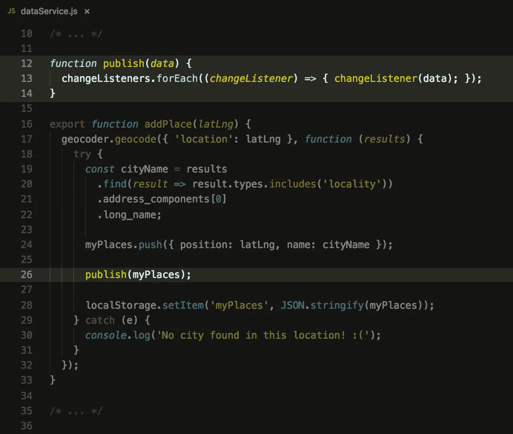**

**然后，可以轻松地在组件中检索数据:**

**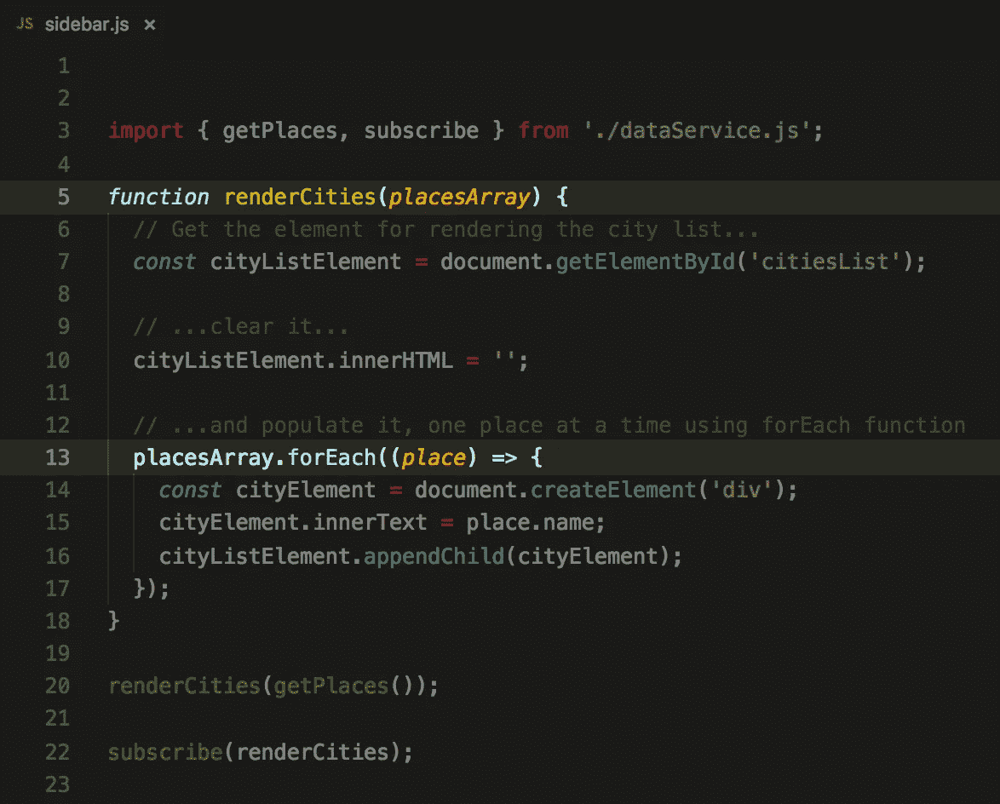**

**这里有更多的可能性——我们可以为不同类型的动作创建不同的主题(或频道)。此外，我们可以提取`publish`和`subscribe`方法来完全分离代码文件并从那里使用它。但是现在，我们很好——下面是一个应用程序的短视频，它使用了我们刚刚创建的相同代码:**

**这整个发布-订阅的事情类似于你可能已经知道的事情吗？仔细想想，这和你在`element.addEventListener(action, callback)`中使用的机制非常相似。你**订阅**你的函数给一个特定的事件，当某个动作被元素**发布**时，这个事件被调用。同样的故事。**

**回到标题:*为什么这个东西这么血腥重要？毕竟，从长远来看，坚持使用普通的 JavaScript 并手动修改 DOM 是没有意义的——传递和接收事件的手动机制也是如此。各种框架都有其既定的解决方案:Angular 使用 RxJS，React 使用状态和道具管理，并有可能使用 Redux 来增强它，实际上每个可用的框架或库都有自己的数据同步方法。***

**嗯，事实是**它们都使用了某种发布-订阅模式的变体。****

**正如我们已经说过的——DOM 事件监听器只不过是**订阅**到**发布** UI 动作。更进一步:什么是`Promise`？从某种角度来说，它只是一种机制，允许我们**订阅**完成某个延迟的动作，然后**在准备好的时候发布**一些数据。**

**反应状态和道具变化？组件的更新机制**订阅了**的变更。Websocket 的`on()`？获取 API？他们允许**订阅**某些网络动作。Redux？它允许**订阅**商店中的变化。还有 RxJS？真是无耻的一大**订阅**格局。**

**原理是一样的。引擎盖下没有神奇的独角兽。这就像史酷比的结局一样。**

**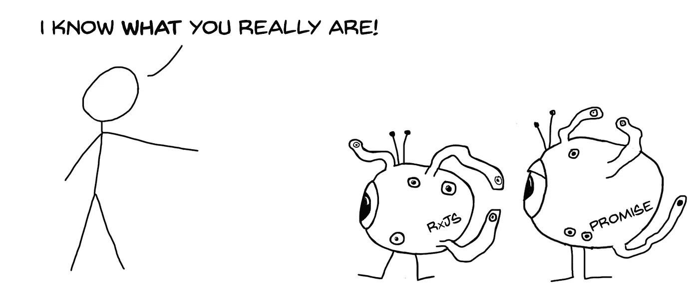**

**这不是一个伟大的发现。但重要的是要知道:**

> **不管你用什么方法来解决异步问题，它总是同一个原则的变体:某个东西订阅，某个东西发布。**

**这就是它如此重要的原因。你总能想到发布和订阅。记下并继续前进。继续构建具有许多异步机制的更大更复杂的应用程序——无论看起来有多困难，都要尝试与发布者和订阅者同步一切。**

**尽管如此，这个故事中仍有许多未触及的话题:**

*   **不再需要时取消订阅侦听器的机制，**
*   **多话题订阅(就像`addEventListener`可以让你订阅不同的事件)，**
*   **扩展的想法:事件总线等。**

**为了扩展您的知识，您可以查看一些以简单形式实现发布-订阅的 JavaScript 库:**

*   **[https://github.com/mroderick/PubSubJS](https://github.com/mroderick/PubSubJS)**
*   **【https://github.com/Sahadar/pubsub.js 号**
*   **【https://github.com/shystruk/publish-subscribe-js **

**继续尝试使用它们，破坏它们并运行调试器，以便了解在幕后发生了什么。还有，有一篇[号的](http://share) [大文章](https://en.wikipedia.org/wiki/Publish%E2%80%93subscribe_pattern) [很好地描述了](https://msdn.microsoft.com/en-us/magazine/hh201955.aspx)。**

**您可以在下面的 GitHub 资源库中找到这个故事的代码:**

**[https://github.com/hzub/pubsub-demo/](https://github.com/hzub/pubsub-demo/)**

**不断地试验和修补——不要害怕这些术语，它们通常只是伪装的普通代码。**

**如果您对与 JavaScript 开发相关的另一个重要主题感兴趣，可以看看我在这个系列中的另一篇文章:[为什么不变性的概念对于一个初级前端开发人员如此重要？](/why-concept-of-immutability-is-so-damn-important-for-a-beginner-front-end-developer-8da85b565c8e)**

**继续想！再见！**