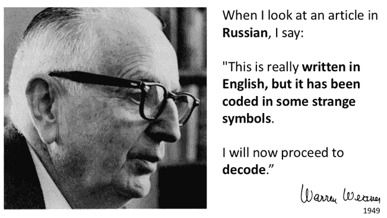
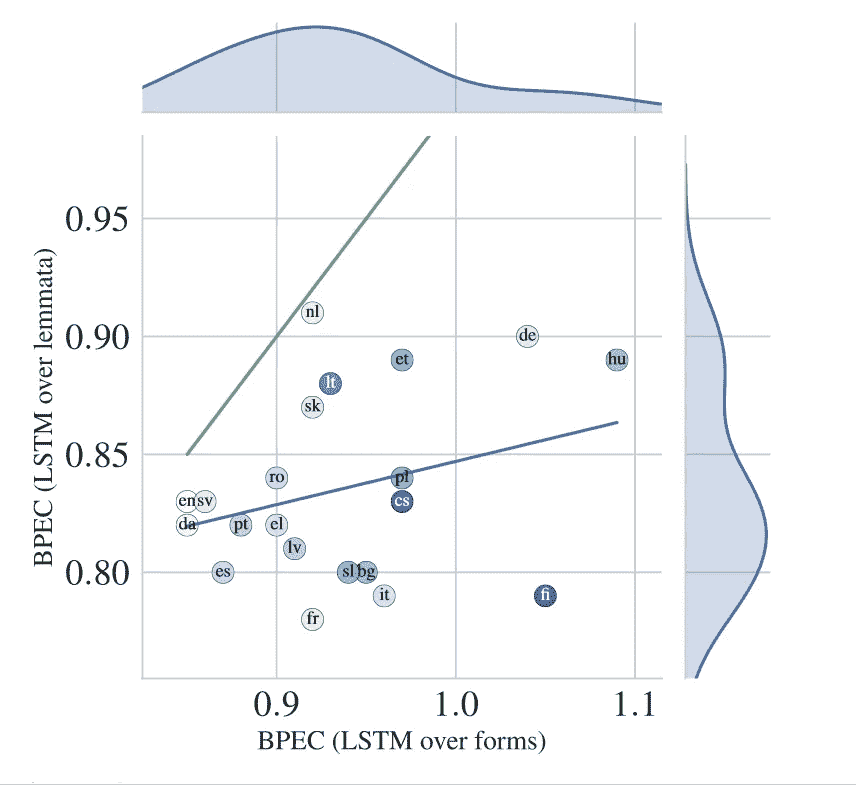
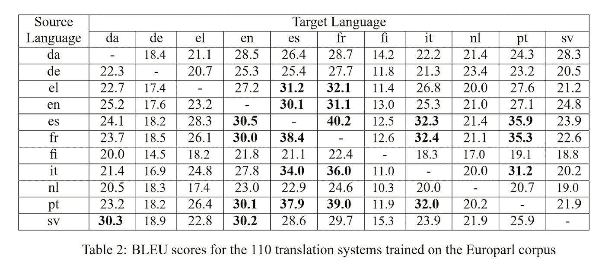
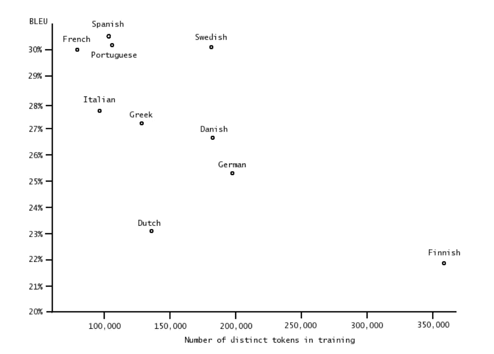

# 为什么俄语到英语很难进行机器翻译

> 原文：<https://itnext.io/why-russian-to-english-is-difficult-for-machine-translation-fddfc008c9a0?source=collection_archive---------3----------------------->

当我们回顾机器翻译的历史，即计算机自动将一种人类语言翻译成另一种语言的科学，我们会发现许多科学始于俄语。最早提到自动化翻译的人之一是俄罗斯人[彼得·特罗扬斯基](https://en.wikipedia.org/wiki/Peter_Troyanskii)，他提交了一份提案，其中包括双语词典和一种基于[世界语](https://en.wikipedia.org/wiki/Esperanto)语法系统的处理语言间语法角色的方法，甚至在计算机出现之前。

第一套基于计算机的机器翻译的建议是在 1949 年由[洛克斐勒基金会](https://en.wikipedia.org/wiki/Rockefeller_Foundation)的研究员[沃伦·韦弗](https://en.wikipedia.org/wiki/Warren_Weaver)在他现在著名的[翻译备忘录](https://en.wikipedia.org/wiki/Warren_Weaver#The_.22Translation.22_memorandum)中提出的。在这里引用的著名备忘录中，他说:“用俄语写的书很容易被说成是用英语写的被编入俄语代码的书。”这些提议是基于信息理论、第二次世界大战期间密码破译的成功以及自然语言的普遍原理。但是韦弗的备忘录并不是这个新兴领域的唯一驱动力。真正启动研究的是对冷战的恐惧，以及美国分析人士希望轻松阅读和翻译俄罗斯技术论文的愿望。Warren Weaver 在 21 世纪初启发了 Language Weaver 的创始人以他的名字命名，该公司是第一个将统计机器翻译(SMT)商业化和产品化的公司，也是 SMT 中许多后续创新的来源。它的校友接着开始了谷歌翻译，摩西，影响亚马逊机器翻译/人工智能倡议，该公司及其知识产权现在归 SDL 公司所有。

最初的乔治敦实验是最早记录的机器翻译项目之一，它在 1954 年成功地将 60 多个俄语句子全自动翻译成英语。乔治敦实验的研究人员断言，他们相信机器翻译将在三到五年内解决问题。这种声称能够在五年内解决机器翻译问题的说法一直是机器翻译界的老生常谈，将近 70 年后，我们看到机器翻译仍然是一个具有挑战性的问题。神经机器翻译的最新进展是受欢迎的，确实是重大的进展，但机器翻译仍然是人工智能中最具挑战性的研究领域之一。70 年的机器翻译研究成果表明，机器翻译问题确实是自然语言处理领域中最难解决的问题之一。值得考虑一下为什么会这样，因为它解释了为什么花了 70 年才到达这里，以及为什么即使在这些令人兴奋的 NMT 突破的日子里，仍然需要更多的时间才能到达“永远完美”的 MT。将机器翻译与自动语音识别(ASR)挑战进行对比可能有助于说明难度。如果我们用一个简单的句子，比如，“今天，我们很高兴地宣布我们正在进行的机器翻译研究取得了重大突破，特别是在俄语到英语的翻译方面。”在 ASR 的情况下，实际上只有一个正确的答案，计算机要么识别了正确的单词，要么没有识别，即使它没有正确识别单词，人们也可以从上下文和其他正确预测的单词中理解。

当问题有二元结果时，计算机表现良好，在二元结果中，事情要么是对的，要么是错的，与“答案”不太清楚的问题相比，计算机往往更有效地解决这类问题。如果我们把正在讨论的句子看作翻译，这是一个非常不同的计算挑战。语言是复杂多样的，同样的事情可以用许多不同的方式表达和翻译。所有这些都可以被认为是正确的。如果你要加上轻微错误或严重错误翻译的可能性，你可以看到有很大范围的置换可能性。这个句子有许多可能的正确翻译，问题就在这里。除了通过概率计算和测量统计数据密度之外，计算机没有真正评估这些变化的方法，而统计数据密度几乎总是完全由你训练的数据来定义。如果你在一个不包含所有可能翻译的数据集上训练，那么你将会错过一些可能性。**事实是，我们从来没有在每一个可能的可接受的翻译上训练一个引擎。**

迈克尔·豪斯曼是 T2 RapportBoost 公司的首席数据科学官。AI 与奇点大学教员。他解释说，机器学习和人工智能的理想场景是有固定规则和清晰的成败衡量标准的东西。他举出国际象棋作为一个明显的例子，并指出机器能够[击败最好的人类围棋手](https://singularityhub.com/2017/10/23/deepminds-new-ai-taught-itself-to-be-the-worlds-greatest-go-player/)。这比任何人预料的都要快，因为这个游戏有非常清晰的规则和有限的或可定义的移动。

豪斯曼阐述道，**“语言几乎与此相反。没有清晰明确的规则。对话可以有无数不同的方向。然后，当然，你需要有标签的数据。你需要告诉机器做对或做错。”**

豪斯曼指出，分配这些信息标签本身就很困难。“两个译者甚至不会就翻译是否恰当达成一致，”他说。就数据而言，语言就像是蛮荒的西部。”

埃里克·坎布里亚(Erik Cambria)是一名学术人工智能研究人员，也是新加坡南洋理工大学的助理教授，他说:“今天机器翻译的最大问题是，我们倾向于从输入语言句子的句法形式到目标语言句子的句法形式。这不是我们人类做的。我们首先解码输入语言中句子的含义，然后将该含义编码到目标语言中。”所有这些阻碍因素在可预见的未来仍然存在，所以我们不应该期待另一次大的飞跃，直到我们找到大量新的高质量的数据，或者在模式检测方法上取得新的突破。
本质上(*过于简化*)，机器翻译是一种模式检测和模式匹配技术，在这种技术中，向计算机显示大量两种语言的清晰等效句子，它通过分析这些例子“学习”如何“翻译”。NMT 的做法与 SMT 不同，但本质上他们都是在显示的数据中检测模式，而 NMT 对模式可能是什么有更深的理解。这就是为什么“训练数据”的质量和数量很重要，因为它定义了可以学习的模式。

我们在过去 70 年中看到的是，越相似的语言越容易建模 *(MT 是一个翻译模型*)。因此，我们看到，为西班牙语< >葡萄牙语建立机器翻译系统要容易得多，因为这两种语言非常相似，并且有许多等价的语言结构。相比之下，英语< >日语将更具挑战性，因为在语言特征、拼写格式(日语可以用 3 种文字书写)、词法、语法、词序、敬语结构等方面都有很大差异。此外，虽然英语< >日语很难，但为日语< >朝鲜语建立模型要容易得多，因为它们在结构和语言上有更多的相似性和等价性。

因此，困难的根本原因是因为两种语言之间的根本语言差异。**在一种语言中存在的语言概念在另一种语言中并不存在，所以对等关系很难用公式表达和建模。**一篇[最近的研究论文](https://ryancotterell.github.io/papers/cotterell+alc.naacl18.pdf)描述了使用 Europarl 语料库的语言建模困难，该语料库的存在允许许多比较研究实验。这项研究的一个关键发现是屈折形态是难度的一个重要因素。在下面的图表中，我们可以看到，DE、HU 和 FI 因此更难，而 SV 和 DA 则更容易，因为它们更相似。

基于 Europarl 数据的一项[前期研究](http://mt-archive.info/MTS-2005-Koehn.pdf)是一个关键参考，用于确定使用大致相同的数据集构建这些对比模型时，哪些组合易于或难以建模。

这个图表显示的是，最容易的翻译方向是西班牙语到法语(BLEU 得分 40.2)，最难的是荷兰语到芬兰语(10.3)。

这表明，有更多的芬兰数据并不能帮助提高输出质量，因为语言差异要大得多。罗曼斯语言比其他语言组合的数据少得多。俄语一直被认为是机器翻译中最难的语言之一，主要是因为它在语言学上与英语有很大的不同。早期的 NMT 尝试无法超越旧的 RBMT 模型，一般来说，SMT 模型很少能够持续击败最好的 RBMT 模型。

俄语与英语在词形变化、词形变化、词序以及与名词的性别关联方面有很大不同。

与英语不同，俄语是一种高度屈折变化的语言。名词上的后缀标志着 6 种不同的情况，这些情况决定了名词在句子中的作用(是主语、直接宾语、间接宾语、被拥有的东西、用作工具的东西还是介词的宾语)。比如这些都是“书”这个词的不同形式:singularplural 主格книга (kniga)книги (knigi)属格кнгии(knigi)книг(knig)与格книге (knige)к

**这是同一个词**的 12 种形式，根据这个词在句子中的作用来使用。但它们并不都是截然不同的。不同的角色可以有相同的形式，比如单数所有格&复数主格。

此外，像西班牙语或法语一样，每个名词都有性别。“书”这个词是阴性的，但这是一个任意的分类；没有理由说一本书(книга kníga)是阴性的，一张桌子(стол stól)是阳性的。但这很重要，因为每个性别的格后缀是不同的(阳性、阴性或中性)。**因此，虽然单词“book”有 12 种不同的形式,“table”也有 12 种不同的形式，但它们并不共享同一套后缀。形容词修饰名词时，需要与名词一致，带相同(或相似)的后缀。**

此外，像西班牙语或法语一样，动词的变化取决于时态(过去与非过去)、人称(我与你、他/她/它)、数(单数与复数)等。**所以一个动词也可能有几种不同的形式**。

在英语中，我们使用词序来完成与俄语中名词后缀相同的事情。因为俄语有这些格标记，他们的词序就自由多了。例如，这些都是可以接受的说“我去商店了”的方式

Я пошёл в магазин.(亚·波索尔诉马加津)

Я в магазин пошёл.(亚诉马加津·波索尔)

Пошёл я в магазин.(波索尔·亚诉马加津)

Пошёл в магазин я.(波索尔诉马加津亚)

В магазин я пошёл.(马加津·亚·波索尔)

В магазин пошёл я.(马加津·波索尔·亚)

я雅=我

пошёл·波索尔

в v = to

магазин magazin =商店

本质上，所有的排序都是可能的，除了介词“to”(вv)必须在“shop”(магазинmagazin)之前。你可以想象，随着句子越来越长，可能的句子顺序结构的数量也在增加。这是有一些限制的:这个例子中的一些命令被省略了，听起来很奇怪或过时，其他的只是用来强调*你要去哪里*或者*谁*要去哪里。但是同样的事情肯定有比英语更多的表达方式，英语的词序更严格。

一般来说，难懂的语言对机器翻译系统开发人员的技能要求更高。Moses 和 OpenNMT 黑客不建议使用这些语言，他们想看看自己的数据在开源软件中会有怎样的表现，一般来说，这些天真的从业者会远离这些语言。

**对于构建俄语< >英语机器翻译系统(例如**)的机器翻译系统开发人员来说，有一些特殊的挑战

*   机器翻译需要更多地注意俄语单词的词形变化，而不是单词的顺序，以知道在英语翻译中该把单词放在哪里
*   机器翻译需要足够灵活，能够翻译以陌生词序出现的熟悉的俄语源句子

因此，俄语到英语是人们可以尝试的最困难的机器翻译组合之一，并且只有最有能力和最熟练的机器翻译系统开发者才能够构建产生被专业人类翻译者判定为“人类等同物”的输出质量的系统。

*原载于 2018 年 6 月 22 日 kv-emptypages.blogspot.com***。**