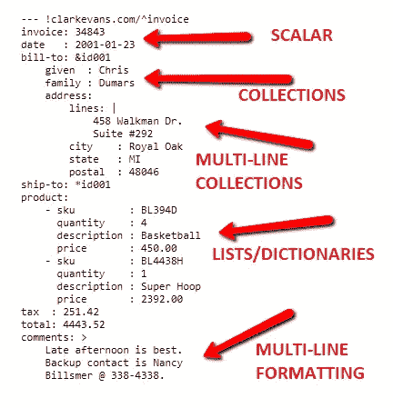

# 对于 Spring Boot 项目中的配置，为什么我们应该选择 YAML 文件而不是属性文件？

> 原文：<https://itnext.io/why-should-we-prefer-the-yaml-file-over-the-properties-file-for-configurations-in-spring-boot-f31a273a923b?source=collection_archive---------1----------------------->



图片来自"[五分钟学会 YAML！](https://www.codeproject.com/Articles/1214409/Learn-YAML-in-five-minutes)”

传统上，Spring 开发人员将他们的配置数据(如参数或缩写设置值)放入一个属性文件中，并在他们的 Spring 应用程序中使用它。在 Spring Boot，我们可以使用 [YAML](http://yaml.org/) 文件代替属性文件。

[YAML](http://yaml.org/) 是一种人性化的数据序列化标准，但主要用于配置文件。YAML 代表 YAML 不是标记语言(递归缩写)。YAML(1.2 版)是 JSON 的超集，是一种非常方便的指定分层配置数据的格式。与属性文件相比，YAML 文件更加清晰易读，还为我们提供了几个独特而有用的功能。YAML 支持地图、列表和标量类型。

`SpringApplication`类将自动支持 YAML 作为属性的替代，它使用 [SnakeYAML](http://www.snakeyaml.org/) 库作为 YAML 解析器。如果您的类路径中有`spring-boot-starter`，那么会自动提供 [SnakeYAML](http://www.snakeyaml.org/) 库。

Spring Framework 提供了两个方便的类，可以用来加载 YAML 文档。`YamlPropertiesFactoryBean`将加载 YAML 为`Properties`,`YamlMapFactoryBean`将加载 YAML 为`Map`。

在本文中，我想比较定义 Spring Boot 项目中配置的这两个标准，并提及 YAML 文件相对于属性文件的优势:

## 一个文件中的多个弹簧轮廓

如果你想在你的 Spring Boot 项目中有多个概要文件，通过使用 YAML 文件，你只需要定义一个配置文件，并将特定概要文件的配置数据放入其中，但是如果你使用属性文件，你需要为每个概要文件定义单独的文件。

例如，您可以在一个 YAML 文件中定义多个概要文件，方法是使用一个`spring.profiles`键来指示文档应用的时间:

```
server:
    address: 192.168.1.100
*---*
spring:
    profiles: development
server:
    address: 127.0.0.1
*---*
spring:
    profiles: production
server:
    address: 192.168.1.120
```

在这个例子中，如果`development`配置文件是活动的，`server.address`属性将是`127.0.0.1`。如果`development`和`production`配置文件未启用，则属性值将为`192.168.1.100`。

当应用程序上下文启动时，如果没有明确激活的概要文件，则默认概要文件被激活。因此，在这个 YAML 中，我们为`security.user.password`设置了一个仅在“默认”配置文件中可用的值:

```
server:
  port: 8000
*---*
spring:
  profiles: default
security:
  user:
    password: weak
```

使用三个破折号，您可以分开两个配置文件并指示一个新配置文件的开始，这样所有的配置文件都可以在同一个 YAML 文件中描述。

## 列表和地图

YAML 支持列表作为分层属性或内嵌列表，例如，YAML:

```
my:
   servers:
       - dev
       - prodmy:
   servers: [dev, prod]
```

会转化成这些特性:

```
my.servers[0]=dev
my.servers[1]=prodmy.servers=dev, prod
```

正如你所看到的，YAML 版本更简洁，更易于阅读。YAML 也支持使用空格的地图:

```
map1:
  key1:value1
  key2:value2
```

除此之外，YAML 支持定义地图的内嵌格式:

```
map1: {key1=value1, key2=value2}
```

## 将一个字符串分成多行

虽然您可以在 Spring Framework 的属性文件中使用反斜杠字符(`**\**` ) )将一个字符串拆分成多行，但是您可以在 YAML 文件中使用更多功能以标准方式完成此操作。为此，YAML 标准中有几种样式，例如，您可以使用 YAML [折叠样式](http://www.yaml.org/spec/1.2/spec.html#id2796251):

```
key: >
  this is a very very very
  long text
```

这种样式删除字符串中的单个换行符，并在末尾添加一个换行符，并将双换行符转换为单个换行符。输出应该是这样的:

```
this is a very very very long text\n
```

也可以使用[文字样式](http://www.yaml.org/spec/1.2/spec.html#id2795688)、 [*双引号样式*](http://www.yaml.org/spec/1.2/spec.html#style/flow/double-quoted) *或* [*单引号样式*](http://www.yaml.org/spec/1.2/spec.html#style/flow/single-quoted) *。*

## 在其他语言和框架中的流行程度

属性文件专门用于 Java 项目，但是 YAML 文件被许多语言、框架和库使用，如果你想在它们之间共享配置，YAML 文件肯定是更好的选择。

## 分级结构

与属性文件的非分层或平面结构相比，YAML 标准的分层结构导致了更易于阅读的配置，考虑以下 YAML 文档:

```
environments:
    dev:
        url: [http://dev.bar.com](http://dev.bar.com)
        name: Developer Setup
    prod:
        url: [http://foo.bar.com](http://foo.bar.com)
        name: My Cool App
```

会转化成这些特性:

```
environments.dev.url=http://dev.bar.com
environments.dev.name=Developer Setup
environments.prod.url=http://foo.bar.com
environments.prod.name=My Cool App
```

正如您所看到的，YAML 文件的层次结构产生了一个可读性更强的配置文件，样板字符更少。

## @财产来源

不能使用`@PropertySource`注释加载 YAML 文件。因此，如果您需要以这种方式加载值，您需要使用一个属性文件。`YamlPropertySourceLoader`类可以用来在春天`Environment`揭露 YAML 是一个`PropertySource`。这允许您使用熟悉的带有占位符语法的`@Value`注释来访问 YAML 属性。

# 结论

在我看来，在 Spring Boot 项目中，YAML 文件相对于属性文件的主要优势是`Hierarchical Structure`和`Popularity among other languages and frameworks`，如果你想跟上时代并拥有一些现代特征，我强烈推荐使用 YAML 文件而不是属性文件。但是如果您使用属性文件，除了拥有`Multiple Spring profiles in one file`和一个更易于阅读、更简洁的语法以及几个很棒的特性之外，您不会失去任何东西。

# 资源

*   [Spring Boot 官方文件](https://docs.spring.io/spring-boot/docs/current/reference/html/spring-boot-features.html#boot-features-external-config-yaml)
*   五分钟学会 YAML！