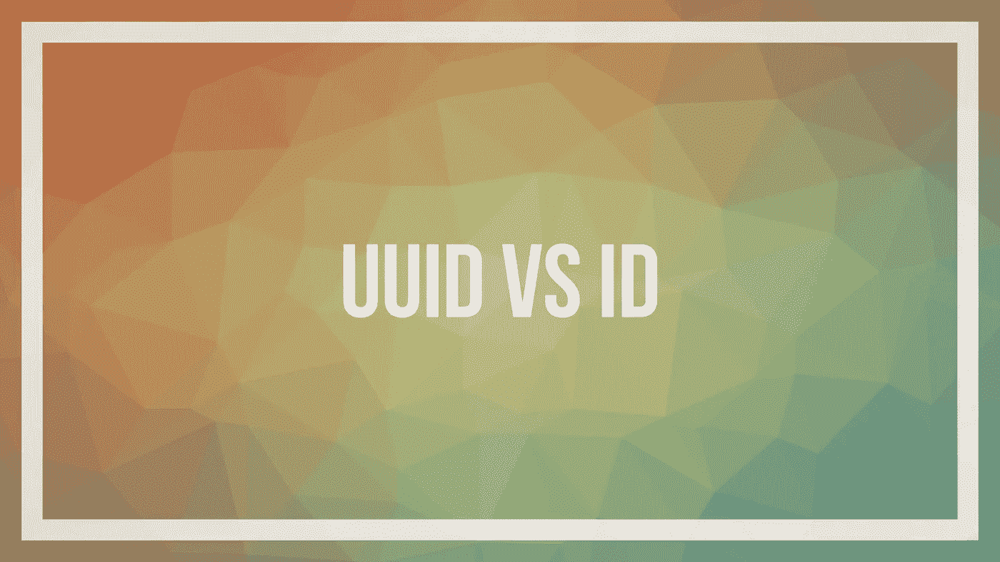

# 为什么使用 UUIDs 比使用 id 更好

> 原文：<https://itnext.io/why-working-with-uuids-instead-of-ids-is-better-b60d22caf601?source=collection_archive---------4----------------------->

## 使用 UUIDs 而不是 IDs 有很多好处。

由[罗南·勒费希特](https://www.blogger.com/profile/04502686129589371941)

最后，我开始使用 UUIDs，我将给出三个原因:

## 1.当您向客户提供 id 时，他们可能知道记录的数量。

如果你是一家小公司，这可能算不了什么，但是你把这些信息给了你的竞争对手和恶意用户。

例如，如果您创建了一个新用户，服务器将增加数据库中的 ID，并给您一个最大的(最新的)ID。所以如果你的用户是 1334 号。您可以猜测数据库中用户的大小。

## 2.您可以随机猜测资源的路径。

我假设您有一个 [RESTful](https://en.wikipedia.org/wiki/Representational_state_transfer) 应用程序。正因为如此，我们(客户)可以很容易地猜出访问某些信息的正确路径。

如果我的号码 id 是 1234，我应该可以输入类似[https://example/com/API/users/1234](https://example/com/api/users/1234)的内容。

因为是顺序 ID，所以我可以猜测以前的标识符应该可以通过在我的 ID 之前输入一个 ID 来接收不属于我的用户的信息:[https://example/com/API/users/1233](https://example/com/api/users/1233)。

当然，服务器应该已经实现了一些权限特性，但是这个请求会命中数据库，找到用户(因为这个 ID 存在)然后限制它。

使用这样的 UUID***" 92245 CD 7–8b 41–4ce 7–9 bef-d 135 b 936254 c "***，是不可能猜出另一个用户标识符的。而这是一件非常好的事情！

## 3.您可以通过指定一个 UUID(如果该记录尚未保存在您的数据库中)来赋予您的客户端创建记录的能力

您可以通过指定一个 UUID(如果该记录尚未保存在您的数据库中)来赋予您的客户端创建记录的能力。

前端客户端可以用自己的标识符创建新对象，而无需询问后端。这样，前端开发人员就有了更多的自由，不会覆盖 API 调用。

# 相关文章:

 [## 在 Rails 6 应用程序中使用 UUIDs

### UUIDs 结合 PostgreSQL 和活动记录的威力

itnext.io](/using-uuids-to-your-rails-6-application-6438f4eeafdf)