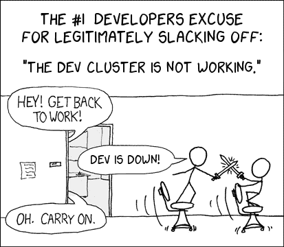

# 为什么您不应该忽视您的开发人员的 Kubernetes 集群

> 原文：<https://itnext.io/why-you-should-not-neglect-your-developers-kubernetes-clusters-a658c8ca0e78?source=collection_archive---------1----------------------->

[原图](https://xkcd.com/303/)由 XKCD 的兰道尔·门罗创作。在[知识共享署名-非商业性 2.5 许可](https://creativecommons.org/licenses/by-nc/2.5/)下发布。

所以你最终成功地说服了你的组织使用 Kubernetes，你甚至在生产中获得了第一批服务。恭喜你！

您知道生产工作负载的正常运行时间至关重要，因此您设置了尽可能可靠的生产集群。您添加了各种监控和警报功能，这样，如果您的 SREs 出现问题，就会得到通知，并以最高优先级修复它。

但是这是昂贵的，并且你也想要有暂存和开发集群——甚至可能一些操场。由于预算总是紧张，您开始考虑…

`DEV`是怎么回事？肯定不可能有`PROD`那么重要吧？不对！

所有这些漂亮的新技术和过程的主要目标是开发人员的生产力。我们希望增强开发者的能力，让他们能够更快地发布更好的软件。

但是如果你不太重视你的`DEV`集群的可靠性，你基本上是在说“阻止我的开发人员是可以的”，这间接地转化为“付给开发人员(内部和外部)很多钱，让他们无所事事半天而不能高效工作是可以的”。

此外，没有一个开发者喜欢听到他们没有你的客户重要。

# 什么会出错？

让我们来看看当不重视开发时，您可能会遇到的一些问题，以及它们可能产生的影响。

这些不是我想出来的。在过去两年多的时间里，我们见证了所有这些事情的发生。

# 场景 1:开发集群的 K8s API 关闭

您精心构建的 CI/CD 管道现在正在产生大量错误。几乎所有的开发人员现在都被封锁了，因为他们不能部署和测试他们正在构建的任何东西。

这实际上在`DEV`比在`PROD`的生产集群中影响更大，因为你最重要的资产是你的工作负载，当 Kubernetes API 关闭时，它们应该还在运行。也就是说，如果您没有在 API 上构建任何强依赖性。您可能无法部署新版本，但是您的工作负载很好。

# 场景 2:集群已满/资源压力

一些开发者现在被禁止部署他们的应用。如果他们尝试(或者管道只是推出新版本)，他们可能会增加资源压力。

豆荚开始被杀死。现在，您的优先级和 QoS 类开始生效——您确实记得设置它们，对吗？还是说这在`DEV`中并不重要？希望您至少保护了您的 Kubernetes 组件和关键附加组件。否则，您将看到节点停止运行，这又会增加资源压力。以为`DEV`集群可以用更少的缓冲？再想想。

不幸的是，这种情况在`DEV`发生得更多，原因有二:

1.  重型 CI 正在运行`DEV`
2.  不太强调资源、优先级和 QoS 类别的清晰定义。

# 场景 3:关键附加组件失败

在大多数集群中，CNI 和 DNS 对您的工作负载至关重要。如果您使用入口控制器来访问它们，那么这也很重要。你真的很前卫，已经在运营一个服务网络了？恭喜你，你添加了另一个关键组件(或者说是一大堆组件——看着你 Istio)。

现在，如果上述任何一项开始出现问题(并且它们确实在一定程度上相互依赖)，您将开始看到工作负载左右分散，或者，对于入口控制器，它们在群集外部不再可达。这在影响尺度上听起来可能很小，但只要看看我们过去的事后分析，我必须说入口控制器(我们运行社区 NGINX 变体)拥有最大的份额。

# 发生了什么事？

许多可以想象和不可想象的事情都可能发生，并导致上述情景之一。

我们经常看到由于工作负载的错误配置而产生的问题。也许你已经看到了下面的一个(列表不是决定性的)。

*   CI 正在疯狂运行，让您的集群充满了没有任何限制的 pod
*   CI 为您的 API“添加剂量”
*   错误的 TLS 证书搞乱了你的入口控制器
*   Java 容器接管整个节点并杀死它们
*   …

和很多团队共享`DEV`？给了每个团队`cluster-admin`的权利？你会很开心的。我们已经看到了很多事情，从对入口控制器模板文件的“小”编辑，到有人意外删除整个集群。

# 结论

如果上面没有说清楚:`DEV`集群很重要！

请考虑一下:如果您使用集群来高效地工作，那么就可靠性而言，它应该被认为与`PROD`同样重要。

集群通常需要始终可靠。让他们只在工作时间可靠是很棘手的。首先，你可能有分散的团队和外部人员在非正常时间工作。其次，在非工作时间发生的问题可能会变得更大，一旦工作时间开始，需要更长时间才能解决。后者是我们始终提供 24/7 支持的原因之一，即使我们只能以更低的价格提供工作时间支持。

你应该考虑的一些事情(不仅仅是针对`DEV`):

*   确定集群规模时，请注意资源压力问题。包括缓冲剂。
*   使用名称空间分隔团队(使用访问控制！)或者甚至不同的簇，以减小误用的爆炸半径。
*   使用正确的请求和限制配置您的工作负载(尤其是 CI 作业！).
*   强化您的 Kubernetes 和附加组件以应对资源压力。
*   限制对关键组件的访问，不要给出`cluster-admin`凭证。
*   让你的特工待命。这意味着人们将在`DEV`被呼叫。
*   如果可能的话，让您的开发人员能够轻松地重建`DEV`或[自己开发集群](https://blog.giantswarm.io/how-giant-swarm-enables-a-new-workflow/)。

如果你真的需要省钱，你可以尝试在下班时间缩减开支。如果你真的擅长启动或重建`DEV`，即从集群创建到应用部署都实现自动化，那么你可以尝试“丢弃集群”，即在一天结束时丢弃的集群，并在工作时间前不久开始新的集群。

无论你决定什么，请，请，请，不要阻止你的开发者，他们会更高兴，你会得到更好的软件，相信我。

由 [Puja Abbassi](https://twitter.com/puja108) 撰写——开发者倡导者@ [巨型蜂群](https://giantswarm.io/)

 [## Puja Abbassi (@puja108) |推特

### Puja Abbassi 的最新推文(@puja108)。开发者倡导者@ GiantSwarm & Researcher 主题:码头工人…

twitter.com](https://twitter.com/puja108)