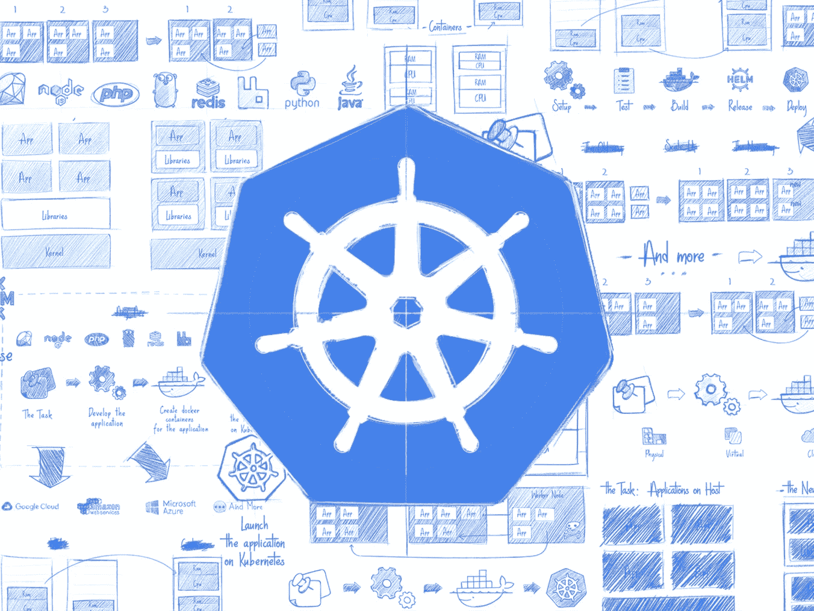
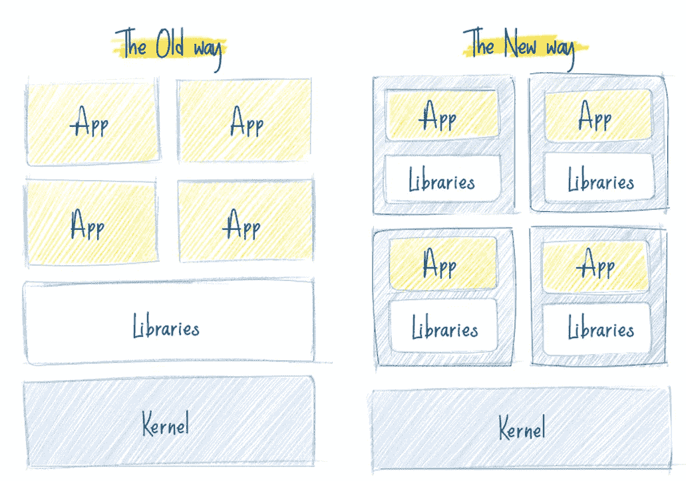
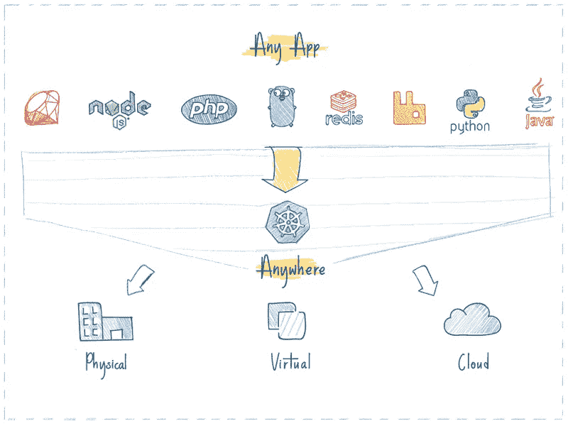
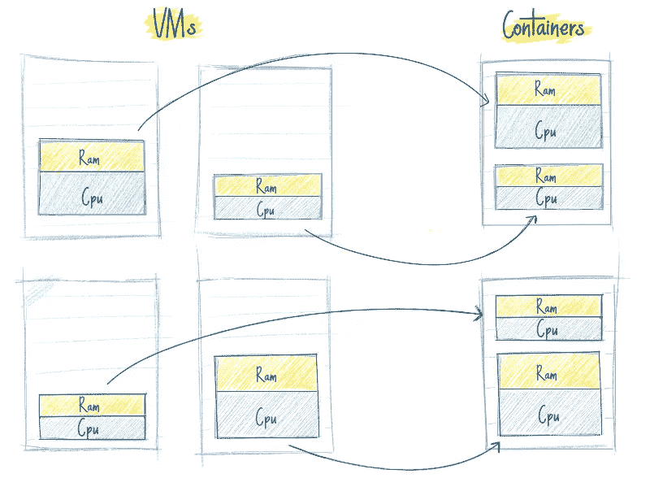
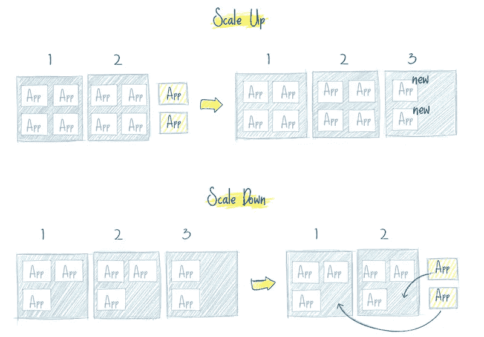
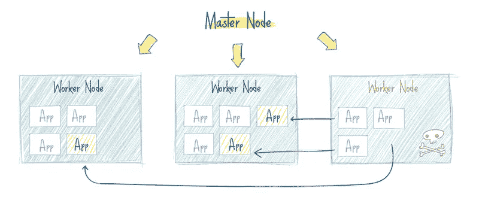

# 为什么你应该在你的下一个项目中使用 Kubernetes

> 原文：<https://itnext.io/why-you-should-use-kubernetes-in-your-next-project-8081c7b6c6e0?source=collection_archive---------1----------------------->

*说真的，容器编排工具有什么特别的？让我们打开 Kubernetes 的包装，看看里面有什么。*

如果你已经有几个月没有生活在岩石下了，你可能听说过 Kubernetes，又名 Kube 或 K8s，它是市场上最好的容器编排工具之一。乍一看，与 Docker Compose 相比，Kubernetes 可能看起来像火箭科学。然而，由于在初始设置上付出了更多的努力，您将获得一个可扩展、灵活且耐用的云平台，非常适合微服务。

# 什么是容器？

简而言之，容器是一个包含应用程序代码及其启动应用程序所需的所有依赖项的包。容器内的应用程序与主机系统的其余部分相隔离，并且总是以相同的方式运行，不管环境如何。

与虚拟机不同，容器不必贯穿操作系统启动的整个周期。这就是为什么它们可以更快地开始和结束工作，并更有效地利用磁盘、内存和处理器容量。此外，你不必记住用什么语言和框架来编写一个应用程序，因为它被打包到一个容器中，里面有它需要的一切(运行时、库等)。)可以在任何环境中安全地迁移和部署。

*在传统模式中(左侧)，应用程序直接部署在服务器或虚拟机上。与它们不同，容器化基础设施中的应用程序都被打包到一个单独的容器中，这意味着它们将在任何环境中启动更快、扩展更智能、运行更流畅。*

# 什么是 Kubernetes？

Kubernetes 是一个开源项目，用于将容器化应用集群作为一个统一的系统进行管理。Kubernetes 管理打包到容器(也称为“pod”)中的应用程序组的可伸缩性、复制和健康状况，并解决在大量主机(节点)上启动和平衡 pod 的问题。该项目最初由 Google 发布，现在得到了许多公司的支持，如微软、RedHat、IBM 和 Docker。

当编写一个将进一步容器化的应用程序时，最好从一开始就有一个微服务方法。否则如果 app 写的是 monolith，以后就很难打包成容器了。

让我们快速浏览一下与虚拟机相比 Kubernetes 的一些最显著的优势。

# 1.一个平台来统治他们

有了 Kubernetes，部署任何应用程序都轻而易举。一般来说，如果一个应用程序可以打包到一个容器中，Kubernetes 肯定能够启动它。

无论使用何种语言或框架来编写应用程序(Java、Python、Node.js 等)。)，Kubernetes 能够在任何环境中安全地启动它，无论是物理服务器、虚拟机还是云。

# 2.云不可知论

你有没有尝试过将基础设施从 GCP 迁移到 AWS 或 Azure？有了 Kubernetes，您不必担心云服务提供商的特性，因为它可以处理任何特性。设计您的基础设施一次，并运行在任何地方。很酷，不是吗？

Kubernetes 与主要的云提供商完全兼容，如谷歌云、亚马逊网络服务和微软 Azure。它在 CloudStack、OpenStack、OVirt、Photon 和 VSphere 上也能很好地工作。

# 3.资源利用效率高

看下图。在左侧，您可以看到四个虚拟机，其中正在运行的应用程序用黄色和蓝色标出，而空白区域是未使用的内存和处理器容量。在右边，您可以看到同样的应用程序被打包到容器中。你能感觉到不同吗？

Kubernetes 有助于节省成本并有效利用内存和处理器资源

当 Kubernetes 发现节点没有充分发挥其能力时，它会在它们之间重新分配 pod，以关闭未使用的节点并停止浪费资源。此外，如果一个节点由于某种原因关闭，Kubernetes 将简单地重新创建在该节点上运行的 pod，并在另一个节点上启动它们，这样就不会丢失数据。

# 4.现成的自动缩放

诸如网络、负载平衡和复制等特性在 Kubernetes 上是现成可用的。Kubernetes 运行的 Pods 默认是无状态的；这意味着，如果在任何时候，其中一个发生故障，最终用户不会注意到他们这边的情况，因为他们的请求会立即由另一个 pod 处理。当 200 个用户突然变成 2000 个时，同样的事情也会发生——必要数量的 pod 可以在需要时自动发挥作用。反之亦然——当服务器负载降低时，Kubernetes 可以自动减少 pod 的数量。

Kubernetes 提高了应用程序的可扩展性，确保它不会在关键时刻崩溃。

# 5.简化的持续集成和部署(CI/CD)

Kubernetes 使 CI/CD 过程不那么痛苦。您不需要精通 Chef 和 ansi ble——您只需要编写一个简单的脚本并在任何 CI 服务上运行它。然后，它将使用您的代码创建一个新的 pod，并将其部署到您的 Kubernetes 集群中。此外，打包到容器中的应用程序可以在任何地方安全地启动——从您的个人电脑到云服务器——使它们非常容易测试。

容器化的应用程序与持续测试、可伸缩性和快速部署的 CI/CD 原则密切相关。

# 6.持久性

Kubernetes 现在如此受欢迎的原因之一是，一个应用程序的顺利运行不能因为一个 pod 甚至整个节点的故障而中断。在这种情况下，Kubernetes 将创建必要数量的应用程序映像，并将它们重新分发到一个健康的 pod 或节点，直到系统恢复。您可以放心，最终用户不会注意到他们这边的任何事情。

容器化的基础设施是自我修复的，即使基础设施的一部分出现故障，也可以提供应用程序的不间断运行。

# 结论

Kubernetes 使启动、迁移和部署容器化的应用程序更加容易和安全。因此，不要担心应用程序在迁移后无法正常工作，也不要担心服务器无法处理突然涌入的用户。

你必须记住的唯一一件事是，应用程序最初应该使用微服务方法来开发。否则，如果 app 是 monolith，就很难把它打包到一个容器里。但是与你得到的所有可能性相比，这只是一个小问题，对吗？

*最初发表于*[*yellow . id*](https://yellow.id/blog/why-you-should-use-kubernetes-in-your-next-project)*。*