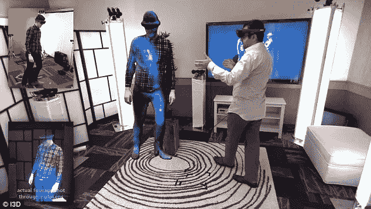
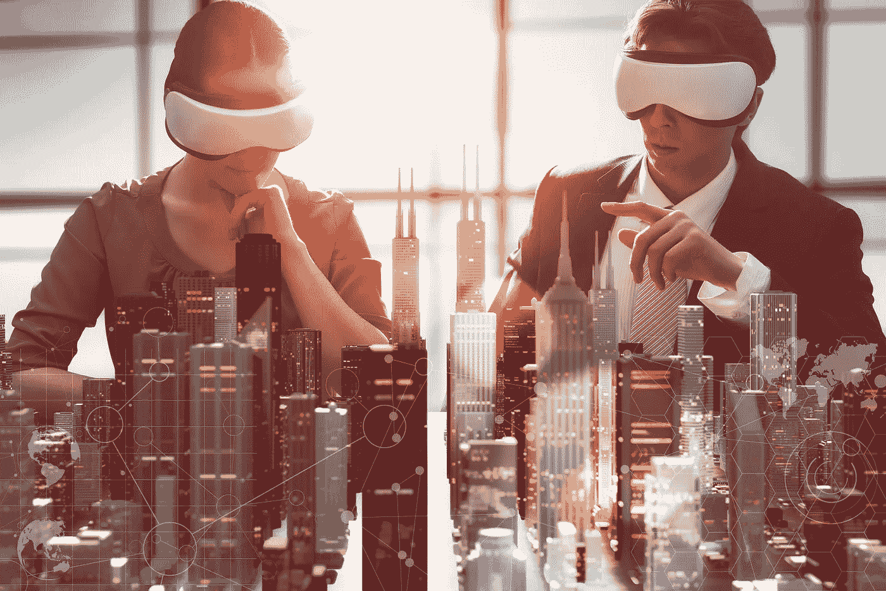

# AR/VR 的问世会拆除写字楼吗？

> 原文：<https://itnext.io/will-the-advent-of-ar-vr-dismantle-the-office-building-9aebcb44172c?source=collection_archive---------1----------------------->

## 通过增强和虚拟现实的技术使它变得可行。

想想你一生中一周内做得最多的事情是什么？你可能回答了工作。

如果你回答，*“睡觉”，*我嫉妒。

如果你回答，*“关爱哭泣的人类”，*你可能会有孩子(尽管*也可能*是工作参考)。

对我们许多人来说，醒着的大部分时间都在一个地方度过:工作。如果你的工作提供了一个标准的工作周，并且你加入了一些休息和午餐的时间，你很可能会花 45 个小时或更多的时间在同一个地方和同样的人在一起，做同样的事情。

增强的虚拟现实会让“去上班”成为过去吗？潜力肯定是存在的，而且技术发展很快。此外，我们中有谁不暗地里(或非常公开地)喜欢在自己家里挣工资的同时放弃昂贵的西装而穿运动服的想法呢？如果不可取，我们可能不会每人收到 427 封完全合法的电子邮件，承诺每周 2300 美元每天“在家工作”。

# 它是如何工作的

先说一个 [Meta](http://www.metavision.com/) 的例子。这家公司在 AR 领域做了一些令人惊讶的事情，已经在内部试验他们称之为 Workspace 的虚拟计算机。

基于眼镜的耳机允许多个屏幕和定制的工作空间，而不需要蜿蜒的计算机电缆或桌子。

你可能会说，*“但这并不会立即转变为在家工作，因为我的雇主可以很容易地给我买一台电脑，让我在家工作。”*

没错。事实上，越来越多的公司正在走这条路。一些公司基于良好的表现和工作效率，在特定的日子提供在家工作。其他人则完全呆在家里，因为办公室并不是所有工作都需要的。允许员工在家工作有明显的好处，雇主越来越有兴趣从中获益。

既然这是理论上的技术，让我们更进一步。如果你的同事只需点击一个按钮就在你身边，那该有多好。

*图片由*[*holo lens*](http://www.dailymail.co.uk/sciencetech/article-3513062/Star-Wars-style-moving-holograms-Microsoft-shows-HoloLens-bring-distant-family-members-home.html)提供

现在，你不再只是在家里用一台工作笔记本电脑，而是在自己的空间里用公司拥有的耳机工作。有了它，您可以随心所欲地拥有任意多台显示器，而无需公司支付额外费用。你也可以号召其他员工进行现实的面对面对话。

也许你可以通过 AR 来做到这一点，在 AR 中，这个人出现在你的客厅中。或者，也许是因为你也有一份兼职工作，做你自己的女佣(报酬并不高，根本没有！)，你的客厅看起来更像斯蒂芬·金的小说。在这种情况下，你可能会选择虚拟现实版本，在虚拟的中立办公室里通过虚拟人物见面。

# 好处

戴上你的 AR 眼镜，选择允许你看到纸杯蛋糕和小狗边框的选项，让我们看看 AR/VR 办公室的优点。

**无行驶时间**

想象一下，如果你在家工作时不坐在锁着的格子里，不生气，不考验你的耐心，你会节省多少时间。你的车寿命会更长，你的保险费率可能会下降，不再有通行费或每月停车证。如果这成为一种普遍的做法，交通问题本身可能会大大减少。

**雇主的间接成本减少**

维护一座办公楼的成本实际上将被消除。没有必要购买 Costco-bulk 风格的桌椅和钢笔。水电费？不见了。大型建筑的税收？也走了。除了可能需要给员工一小笔在家办公用品和购买 AR/VR 工具的预算之外，办公室成本将是不存在的。

**额外节省时间**

想想当你不工作的时候，你在工作相关的事情上花了多少时间。你每天要花多少时间梳理仪容？花在购买或寻找符合特定着装规范的衣服上的时间怎么样(员工手册中有图形化的“该做什么”和“不该做什么”)。既然你不得不做一些可以放在冰箱里，可以很好地重新加热，不会让办公室的微波炉发臭，也不会太吸引人以至于被会计部的 Arlene 偷走的东西，那么有多少精力花在准备一周的工作餐上呢？

**受雇于任何地方**

当没有办公楼时，没有理由因为地理位置而淘汰一个潜在的雇员。只要员工同意遵守他/她的时区规定的时间，你可以在全球而不是你所在的城市找工作。从雇主的角度来看，这让他们有更大的能力来挑选合适的候选人。

# 跨栏

如果远程增强/虚拟现实办公室是一个可行的选择，我们必须承认潜在的问题。因此，请暂时用米尔顿·沃达姆斯的眼镜取代你的纸杯蛋糕/小狗科技镜片。

**缺乏自发创造**

当然，这并不适用于所有领域，但许多办公室都有积极利用即兴时刻的能力。也许大家的精力都起来了，于是召集了一个创意会议。也许你正在努力解决一个问题，突然的喃喃自语会让同事提出一个富有成效的建议。

不过，利用 AR/VR 进行即兴会议的技术并不牵强。这和用手机接电话会议没什么区别。

对于 AR，同样的事情可能会发生，但当你拿起电话时，其余的服务员都在你的客厅里。也许他们看不到你的客厅——他们只能看到你，因为你也站在他们的客厅里。但如果没有适当的警告，你很可能会穿着一件你发誓永远不会承认拥有的 20 世纪 90 年代新款儿童背心，同时舔着一夸脱本杰里的空瓶子。

此外，虽然 AR/VR 场景仍然允许联系同事，但它增加了一个步骤，通常会在开始之前自动关闭。

**隔离**

不管你是在一个繁忙的办公室里工作，还是在一个你几乎独自一人的地方工作，办公室环境为我们提供了人际互动。你走向咖啡壶续杯，在自助餐厅享用午餐，去洗手间休息，和旁边的人小声讲笑话。

从你上班打卡到下班打卡的所有时刻都与人接触。即使只是和其他安静的人坐在一个房间里也能提供一点归属感。我们的心理依赖于此。当缺乏时，我们可能会看到抑郁症的激增。

**生产力的潜在下降**

许多已经允许异地工作的企业都有跟踪员工工作效率的方法。也许它们是有效的，也许员工不像在实体建筑中那样高效。不管最终的真相是什么，因为这将因个人业务类型而异，雇主需要对他们的员工给予更多的信任，以推动 AR/VR 办公室的发展。

**基础设施**

任何类型的 AR/VR 办公楼都需要慢慢融入市场。花点时间想象一下，在你的城市里有多少办公大楼。这些资产不能闲置，如果由于商业模式的广泛变化，公司不能出售这些资产，就会出现财务损失。在这个空间被其他新兴产业蚕食之前，我们将不得不接受缓慢的转变。

不管有没有障碍，在不久的将来，随着增强和虚拟现实技术变得越来越先进，我们可能会看到更多远程工作的例子。

制造业、教育和医疗等其他行业也可能会转向这种模式。不过，我现在还不想深入探讨这些问题。尤其是医学上的，听起来有点乱。