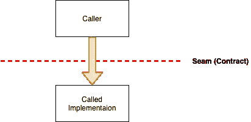
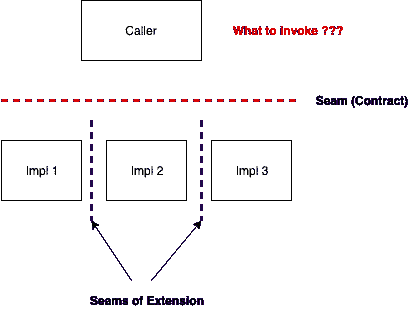
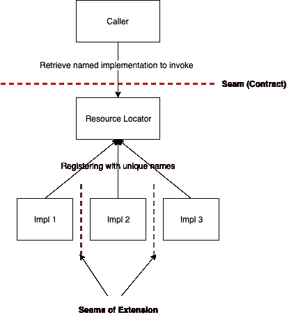

# 使用资源定位器在代码缝隙中工作

> 原文：<https://itnext.io/working-in-the-seams-of-code-with-resource-locator-80435cc47fec?source=collection_archive---------5----------------------->

术语“接缝”是由 Michael Feathers 在他的优秀著作 [*中以通俗的语言引入的，该书将有效地使用遗留代码*](https://www.amazon.com/Working-Effectively-Legacy-Michael-Feathers/dp/0131177052/ref=sr_1_1?crid=3CDGVYC6CT709&keywords=working+effectively+with+legacy+code&qid=1554780196&s=gateway&sprefix=working++effectively+%2Caps%2C358&sr=8-1) 作为一个地方，我们可以在这个地方改变程序的行为，而无需在那个地方进行编辑。或者，seam 是应用程序结构中两个组件相遇的地方，因此是可以测试它们之间交互的地方。

接缝代表契约/接口

术语*接缝*来自裁缝界，指两片布料相遇并缝合在一起的地方。由于 seam 是应用程序的两个组件在明确定义的规则下交互的地方，所以它是测试的好地方，因为我们可以用其他东西(模拟)替换一个组件，而不会影响另一个组件的行为。跨越 seam 截取工作流有助于出色的集成测试。

从软件开发的角度来看，这是一种“对接口编码，而不是对实现编码”的精心表述。然而，这个概念还有另一个层面。软件发展有两种方式——一种是功能的改变，另一种是增加更多的功能。然而，在这两种情况下，我们对可测试性的关注是相同的。这是因为当我们在 seam 上测试一个交互时，我们有效测试的是一个抽象，无论实现如何变化都应该保持这个抽象。

我们处理功能变化的方式看起来很简单——修改 seam 的被调用端，并确保所有测试在变化后都能工作。有道理。那么，我们如何添加更多的功能或给定功能的多种风格呢？改变当前的实现违反了面向对象编程的 [*开闭原则*](https://en.wikipedia.org/wiki/Open%E2%80%93closed_principle) ，肯定会导致代码中断(即使是无意的)。最安全的做法是，如果可以为该功能编写一些新代码，并且在不更改现有代码的情况下调用它。但是如何做到这一点呢？

我喜欢引入新功能的方式是在 seam 的被调用端编写同一个接口的多个实现。这将引入与先前边界正交的边界。但是，这些和我们之前讲的有很大的不同。这些更像是隔离室或筒仓——它们之间没有交互，一端的东西甚至不知道另一端有其他类似的东西，我们可以不断添加更多这样的东西，从而不断扩大所提供的各种功能。因此，要添加新功能，我们只需再添加一个实现，并将其放在现有的实现之间。有我们*延伸*的接缝。

然而，现在打电话的人有一个问题。它应该如何在不改变大量代码的情况下调用一个或多个可用的实现呢？

正交接缝在不干扰现有代码的情况下提供了扩展空间

输入 [*资源定位符*](https://en.wikipedia.org/wiki/Service_locator_pattern) (又名*服务定位符*)。

我们引入了一个资源定位器，所有的实现都向它注册自己，我们将它公开给调用者，而不是让他直接绑定到接口(通过依赖注入等)。资源定位器现在允许调用者访问实现的“命名”实例(名称是唯一的)，从而让调用者控制要调用的代码。因此，定位器充当了跨越 seam 的桥梁，允许调用者从众多实现中选择合适的实现。一旦定位器返回名称实例，调用者就可以像以前一样调用它，我们不会看到任何行为上的差异。

资源定位器提供对动态场景中多个实现的访问

这对代码结构的总体影响是，我们可以继续向代码中添加越来越多的功能，而不必修改现有的代码。它还保持调用者和被调用者之间的契约不变，从而保持了跨 seam 的可测试性。事实上，出于测试目的模仿代码变得更加容易，因为现在有了一个中央访问点(资源定位器)，可以操纵它来给出测试所需的任何实现。

耦合的本质也发生了变化——调用者以前不知道 seam 另一边的实现，但现在它必须请求一些特定的实现，也就是说，它直接知道有多种风格可供选择。这种意识并不总是可取的，因此这种设计应该只用于调用方的动态条件决定使用什么实现的场景，因此我们不能在编译时将实现绑定到调用方。当构建代码超结构时，它也很有用，这些代码超结构需要通过一些框架代码链接同一个接口的多个实现(web 服务器中的请求过滤器就是一个很好的例子)。资源定位器+seams 组合允许我们编写越来越多的实现，并通过将它们的名称添加到框架可以读取和处理的一些配置中来将它们添加到链中。

*如果你喜欢这篇文章，你可以订阅* [*我的邮件列表*](https://www.kislayverma.com/) *来获得最新消息。*