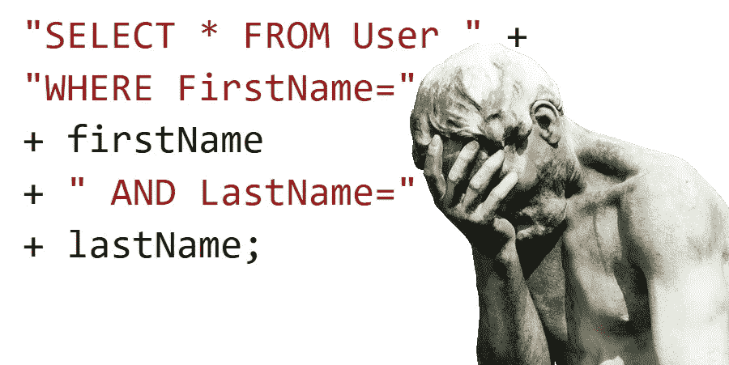

# 在不应该使用 ORM 的时候用 C#编写 SQL

> 原文：<https://itnext.io/writing-sql-in-c-or-when-you-should-not-use-orm-5800a868db43?source=collection_archive---------1----------------------->



我注意到当有必要在。Net 应用程序，开发人员经常选择一些 ORM 库(。Net 实体框架)，甚至没有考虑其他替代方案。乍一看，这是一个合理的决定，因为对于流行的 ORM 库来说，有很多教程、很棒的工具包和很多有经验的开发人员。但是，这并不总是一个好的选择，如果您的应用程序:

1.  主要处理事实关系，而不是对象
2.  需要使用动态(非预定义)查询

# 事实关系

如果您的应用程序主要实现与这些类似的用例:

1)“给我一份按部门分类的薪水最高的员工名单”

2)“给所有 4 月份注册的客户打折”

3)“将去年系列的 t 恤价格降低 20%”

那么您的应用程序将关注事实关系而不是对象，因为所有这些场景都涉及处理不可预测的数据量。例如，组织可能有 2 个部门和 30 名员工，或者有数百个部门和数十万名员工。如果使用某种 ORM，则假设所有数据都被加载到内存中，然后进行分析，如果是写操作，则上传回 SQL 数据库。显然，这不能不影响性能。

*注。现代 ORM 库有许多方法来解决性能问题，如 LINQ 表达式可转换为 SQL、延迟加载等。但我们必须记住，这些只是部分缓解概念问题的技巧，问题在某些时候不可避免地会出现。*

另一方面，SQL 是专门为处理事实关系而设计的，上面描述的场景可以用几个相对简单的表达式来实现。显然，在这里使用没有任何 ORM 的纯 SQL 是有意义的，但是我们有什么选择呢？没有那么多。常见的有:

1)存储过程

2)基于文本的查询

3)一些基于 LINQ 的查询构建器(例如“LINQ 到数据库”)

4) [我的图书馆“sq express”](https://github.com/0x1000000/SqExpress):)

# 存储过程

当您需要使用本机 SQL 的全部功能时，首先想到的是存储过程，但是这种方法有几个严重的缺点:

1) **维护困难**——总是需要确保。Net 代码与应用程序使用的所有数据库实例中的存储过程代码同步。这意味着您注定要在几乎每个部署中弄乱迁移脚本，并且不可避免地会在某个时候出错。

2) **SQL 是一种很棒的查询语言，但却是一种非常糟糕的编程语言** —一旦你开始编写存储过程，你将很难抵制将尽可能多的逻辑移入其中的诱惑，因为这是一种解决性能问题和快速修复应用程序设计中的问题的简单方法。但是不利的一面是，您将无法将您的逻辑分解成小模块并孤立地测试它们(我经常看到内部有数百个变量的五千行的“超级”过程)

3) **复制粘贴** —程序中的代码很难重用(不过函数部分解决了这个问题)，所以一些通用的逻辑会在很多程序中重复。

4) **难以实现批量加工**。 *UpdateUserById* —这是存储过程的典型名称。但是如果我有 100 个用户呢？没问题！让我们调用过程 100 次！唯一的问题是，这将花费 100 倍的时间(一些数据库支持表值参数，但这种参数很难使用和维护)。

5)如果您需要动态查询，存储过程没有帮助

6)如果您经常使用存储过程，那么迁移到另一个 SQL 数据库将会非常困难。

# 基于文本的查询

由简单的字符串连接产生的查询是非常糟糕的。这样的代码很难编写、阅读和维护。安全性也是一个大问题——Sql 注入在今天仍然是相关的。

然而，令人惊讶的是，这种方法也有一些积极的方面:

1)除了任何其他方法之外，您还可以使用该方法

2)它仍然是创建每个人都可以使用的动态查询的最流行的方法。

# 基于 LINQ 的查询构建器

当您需要达到 SQL 能力时，这样的查询构建器(例如[“LINQ 到数据库”](https://linq2db.github.io/))可能是一个不错的选择。“左”、“右”、“全”、“交叉”连接等。不再是一个问题——您可以直接用 C#代码表达它们(使用 LINQ):

```
//Full Join
var query =
    from c in db.Category
    from p in db.Product.FullJoin(pr => pr.CategoryID == c.CategoryID)
    where !p.Discontinued
    select c;
```

*也支持 cte*

```
//CTE
var employeeSubordinatesReport  =
   from e in db.Employee
   select new
   {
      e.EmployeeID,
      e.LastName,
      e.FirstName,
      NumberOfSubordinates = db.Employee
          .Where(e2 => e2.ReportsTo == e.ReportsTo)
          .Count(),
      e.ReportsTo
   };

var employeeSubordinatesReportCte = employeeSubordinatesReport
                                       .AsCte("EmployeeSubordinatesReport");var result =
   from employee in employeeSubordinatesReportCte
   from manager in employeeSubordinatesReportCte
                      .LeftJoin(manager => employee.ReportsTo == manager.EmployeeID)
   select new
   {
      employee.LastName,
      employee.FirstName,
      employee.NumberOfSubordinates,
      ManagerLastName = manager.LastName,
      ManagerFirstName = manager.FirstName,
      ManagerNumberOfSubordinates = manager.NumberOfSubordinates
   };
```

然而，当涉及到动态查询时，LINQ 并不是最好的解决方案。理论上，改变表达是可能的，但这不是一个简单的动作。

# SqExpresss

多年来，我一直不喜欢使用 SQL。但是后来我写了[我自己的库(SqExpress)](https://github.com/0x1000000/SqExpress) 它允许我尽可能接近 SQL 地写 C #代码。它不使用 LINQ —查询构建是通过助手函数和操作符重载实现的。因此，动态查询没有任何问题。这里有一个例子:

# **还是 ORM？**

还有一个问题:“什么时候 ORM 是一个好的解决方案？”良好的..让我们颠倒一下不推荐使用 ORM 的条件:

1.  在绝大多数情况下，您可以准确地预测数据库表中将被读取或修改的行数(这意味着所有数据都可以映射到对象)
2.  不经常需要动态查询

如果满足这些条件，那么 ORM 很可能是正确的选择。

—

我希望这篇短文能帮助您决定哪种使用 SQL 数据库的方式最适合您的应用程序，或者至少您会有所反思，而不会做出草率的决定。

链接:

*   [linq to db on github](https://github.com/linq2db/linq2db)
*   [github 上的 SqExpress](https://github.com/0x1000000/SqExpress)
*   [“语法树和与 SQL 数据库交互的 LINQ 的替代方案”](/syntax-tree-and-alternative-to-linq-in-interaction-with-sql-databases-656b78fe00dc?source=friends_link&sk=f5f0587c08166d8824b96b48fe2cf33c) -我的与此主题相关的文章预览