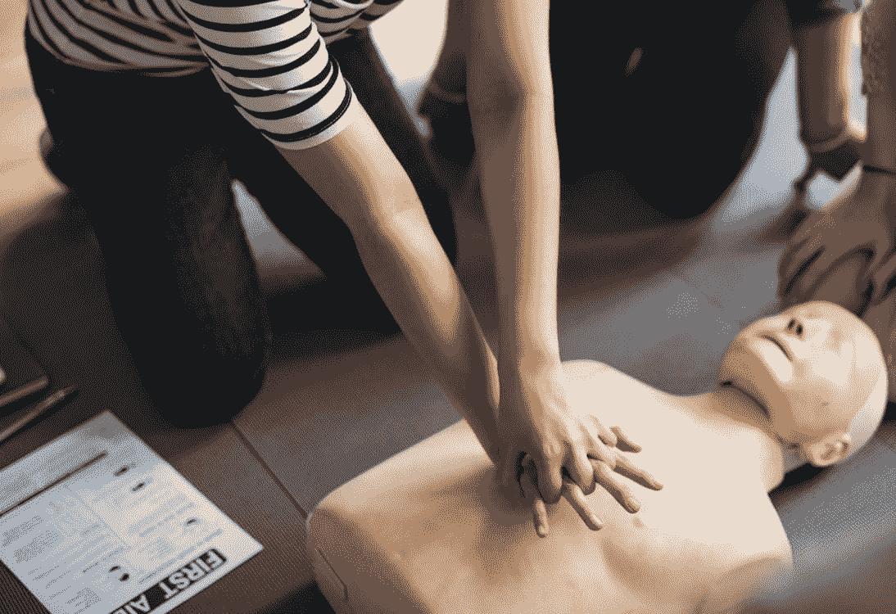

# 是的，这就是如何缓存网页的网址与 Vue，Vue 路由器和保持活力

> 原文：<https://itnext.io/yes-this-is-how-to-cache-pages-by-url-with-vue-vue-router-and-keep-alive-component-697ed76896e8?source=collection_archive---------2----------------------->

在过去，Ionic 1 对我来说是最好的混合移动框架。有两个原因:

*   用户界面和内置组件非常棒，而且功能齐全
*   路由器上的每路由高速缓存系统是一个省时的系统

当您创建移动体验时，您知道带宽是一个真正的问题，因此，您不希望您的用户一直看到加载器。您希望尽可能少地调用 API。

当你的用户看到一个页面，导航出去，然后回来，你不希望在大多数情况下重新加载内容，因为内容可能没有在你的用户的会话中改变。

在脸书应用程序上，每个视图大部分时间都被缓存。

可惜我在 Vue 路由器里没有发现任何内置的缓存系统。

让我详细分解一下:

*   我有一个组件显示一个**动漫**项目
*   我将这个组件链接到一个路由器，路径是: **/anime/:id**
*   在组件中，我通过 ID 进行 API 调用来显示内容
*   如果我去 **/anime/1** ，组件被创建并渲染
*   如果我去 **/home** ，然后回到 **/anime/1** ，
    组件被重新渲染，没有缓存

我们能解决这个问题吗？是的，我看到你来了:

> 您可以使用 **keep-alive** 组件进行缓存

这只是部分正确。让我们看看 **keep-alive** 是如何工作的。

**keep-alive** 组件缓存**整个组件**，而不是根据其 URL 呈现的组件。
为什么？因为 **keep-alive** 没有绑定到 Vue 路由器，它是 Vue 本身的内置组件，所以它与路由器的状态没有直接联系。

**保活**产生以下行为:

*   我去 **/anime/1** ，组件被创建、渲染并保持活动
*   我去**/首页**，然后回到**/动漫/3** ，
    页面会显示**/动漫/1** 的内容

> 确保在转到一个动漫 URL 之前总是转到 **/home** ，因为尽管使用了 **keep-alive** ，当 Vue 路由器从 **/anime/1** 转到 **/anime/2** 时，它并没有改变组件，只是改变了 URL。要修补这个问题，您需要**观察****$ route**属性，并相应地更新您的组件，但是在这个例子中这是不必要的。如果你想挖掘它:[点击这里](https://router.vuejs.org/guide/essentials/dynamic-matching.html#reacting-to-params-changes)。

没有**保活**的例子:[见](https://jsfiddle.net/darkylmnx/ey9acx1z/30)例子。
示例同**保活** : [参见示例](https://jsfiddle.net/darkylmnx/ey9acx1z/29)。

可以看到， **keep-alive** 组件创建缓存，但是现在所有的 URL**/anime/:id**都会显示第一个缓存的动漫页面的内容。

如何才能避免这种情况？通过使用**路由器视图**上的**键**支柱。

[E](https://jsfiddle.net/darkylmnx/ey9acx1z/28/) 带**键**道具示例:[见示例](https://jsfiddle.net/darkylmnx/ey9acx1z/31)。

为什么这能解决我们所有的问题？要完全理解为什么，你需要理解**键**道具在 Vue 中的作用以及**路由器视图**是如何工作的。

**键**道具用于区分虚拟 DOM 中的相同元素。

**路由器-视图**是**的高级版本<组件是=… / >** 。
知道了，当你从 **/a** 到 **/b** 的时候，**组件 A** 和**组件 B** 被交换，一个替换另一个在虚拟 DOM 中的相同位置。
这就是为什么当你从 **/anime/1** 移动到 **/anime/2** 时，路由器不会破坏组件来重新创建它，因为对于 Vue 来说，两者使用的是同一个组件，所以没有必要破坏它重新创建。

我们给**路由器视图**添加了一个**键**道具，基本上就是说:

> 考虑到每个键的每个**路由器视图**是一个不同的组件

然后，由于我们的 **keep-alive** 组件，它将按键缓存每个组件，因为在我们的例子中每个键是一个 URL，它将按 URL 进行缓存:)

让我来分解一下:

*   在 **/home** 上， **keep-alive** 缓存**<router-view key = "/home "/>** ，它评估为 Home 组件**<Home key = "/Home "/>**
*   在 **/anime/1** 上，它缓存了**<router-view key = "/Anime/1 "/>** ，它评估为动画组件**<Anime key = "/Anime/1 "/>**
*   在 **/anime/5** 上，缓存了**<router-view key = "/Anime/5 "/>** ，其求值为动漫组件**<Anime key = "/Anime/5 "/>**
*   当回到 **/anime/1** 时，显示绑定到 **key="/anime/1"** 的缓存

这里， **keep-alive** 认为**<anime key = "/anime/1 "/>**和
**<anime key = "/anime/5 "/>**是“不一样的组件”，因为用 **key** 道具我们是在明确地说“它们不一样”。

在这种情况下，你甚至可以直接从 **/anime/1** 转到 **/anime/5** ，因为现在，每个 URL 将在第一次强制重新渲染，但会被缓存以供下次渲染。

## 摘要

*   在 **router-view** 周围添加 **keep-alive** 来缓存每个页面组件
*   在 **router-view** 上添加一个 **key** prop，用 **URL 作为值**，告诉 Vue 如果**组件是相同的但是 key 是不同的**

这就是你所需要的，现在你有了每个页面的 URL 缓存(在内存中)。[https://jsfiddle.net/darkylmnx/ey9acx1z/31](https://jsfiddle.net/darkylmnx/ey9acx1z/31)

明智地使用它，因为它适用于特定的用例，并且您需要在需要时处理缓存失效。

**奖励 1:** 你可以使用 **keep-alive** 组件上的 **max** 道具来限制缓存物品的数量。这将很容易使缓存失效。[https://jsfiddle.net/darkylmnx/ey9acx1z/32/](https://jsfiddle.net/darkylmnx/ey9acx1z/32/)。点击阅读更多关于**最大**道具[的信息。](https://vuejs.org/v2/api/#keep-alive)

**好处 2:** 缓存失效确实取决于您的业务逻辑，但让我给你举个简单的例子。你可以使用**实例钩子** `activated`和`deactivated`来检查用户何时进入一个缓存的组件(因为创建并挂载的组件不会被调用)，并基于一个计数器或某个截止日期重新进行一次 API 调用，[参见示例](https://jsfiddle.net/darkylmnx/ey9acx1z/33/)。

想要发现新鲜的音乐？检查我的项目[https://foreignrap.com](https://foreignrap.com)

PS:如果你想学习如何创建高级组件，可以查看我的课程:[https://courses . maison futari . com/mastering-vue-components-creating-a-ui-library-from-scratch？优惠券=M](https://courses.maisonfutari.com/mastering-vue-components-creating-a-ui-library-from-scratch?coupon=PRESALE) EDIUM

**有 50%的折扣，因为你来自这个故事。**

保持活力