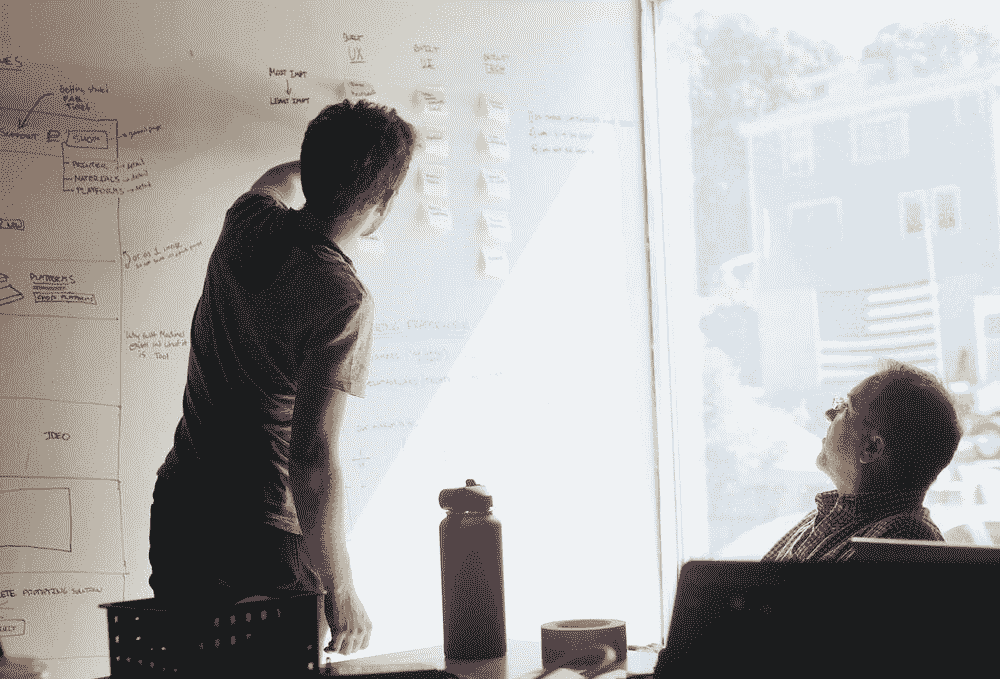

# 你的编程语言并不重要

> 原文：<https://itnext.io/your-programming-language-does-not-matter-63a7ca4a6094?source=collection_archive---------0----------------------->

## 更重要的是你的改进意愿和知识转移

在我的整个职业生涯中，在求职和与数百名招聘人员的接触中，我见证了招聘专业人员或招聘经理对业务中使用的语言和技术的严格态度。一家机构向我提出了采访请求，希望我能对我的方法做一些说明(你可以在这里找到采访)，但由于我最近真的很喜欢写作，我很乐意就这个话题做更多的阐述。

信用:[altum code](https://unsplash.com/@altumcode)[Unsplash](https://medium.com/u/2053395ac335?source=post_page-----63a7ca4a6094--------------------------------)

# 作为商业选择的编程语言

**启动视角**

我把自己想象成一个科技创业公司的创始人。你对产品有一个奇妙的想法，这个想法可能会改变你脑海中的世界。下一步，也是完全自然的一步，是开始将计划付诸实施——考虑所有的活动部分、技术要求，并准备第一份概念证明，即应用程序的框架。你们中的一个很可能有一些编程经验，所以自然地，第一个 [MVP](https://en.wikipedia.org/wiki/Minimum_viable_product) 的语言将是创始团队感到舒服的语言。是经过深思熟虑的选择，还是仅仅出于必要和方便——你现在可以回答，但你可以肯定的是，时间会给你带来痛苦的提醒。

**已建立业务端**

在市场上有了既定地位的企业中，客户使用的产品通常将某一特定的编程语言视为必备，并发誓这是前进的唯一途径。它存在于公司的每个部门；开发团队的每个人都对产品的原则和发展方向有深刻的理解。通常与强硬的“如果有效，不要碰”方法结合使用，不幸的是，这种方法导致企业落后于竞争对手，而竞争对手更热衷于接受新技术，同时保持低成本，通过他们的开源工作或会议吸引注意力(和人才)。

# 作为个人偏好的编程语言

B 上面提到的其他场景虽然从商业角度来看相对较好——毕竟 e *每件事都行得通，而且符合我们的需求* —但对公司未来的发展却远没有达到理想的效果。将产品包含在一种语言的限制中，这很可能是在早期阶段选择的，这不仅会产生定义上的技术债务。它缺乏一种新的视角，而每当企业想要加入*颠覆性的*潮流时，它们通常都渴望这种视角。

语言以与最新技术和趋势相似的速度发展。到现在为止，我已经“做”了整整二十年，我记得自己质疑虚拟化或云计算的必要性——这些东西是 2020 年的必备之物，没有人会想象没有它们的生活。

从 20 世纪 60 年代 IBM 开发第一个 [CP-40](https://en.wikipedia.org/wiki/IBM_CP-40) ，到 2000 年[免费 BSD jails](https://en.wikipedia.org/wiki/FreeBSD_jail) ，以及 2003 年 [Xen hypervisor](https://en.wikipedia.org/wiki/Xen) 的发布，再到在没有高级技术知识的情况下在自己的设备上运行 docker 和 Kubernetes 集群的技术发展。

新的编程语言不时出现，只有少数成为主流，更少能经受住时间的考验成为新标准。无论是作为职业发展还是商业技术的核心，对单一选择的依赖都不应取决于个人偏好。

信用:[凯文 Ku](https://unsplash.com/@ikukevk) [Unsplash](https://medium.com/u/2053395ac335?source=post_page-----63a7ca4a6094--------------------------------)

# 作为工具的编程语言

无论你是致力于简单的创业想法来发展并允许它在未来成长，还是你的代码库由数百个功能库组成——召开白板会议并考虑从头重写一切都不会太晚(看看[我关于这个主题的另一篇文章](https://medium.com/@lukaszraczylo/managing-private-projects-at-scale-a6ff4bf1dff4))。我在 Hailo——“黑色出租车公司”期间学到了这一点，该公司的知名度在某个时候飙升，天才 CTO [Rorie Devine](https://medium.com/u/ff7b2eccda8c?source=post_page-----63a7ca4a6094--------------------------------) 与我们伟大团队的其他成员一起组建并领导了 *Hailo 2.0* 项目(更多信息请参见[马特·海斯](https://medium.com/u/41d046dbb9ae?source=post_page-----63a7ca4a6094--------------------------------)的[帖子](https://medium.com/@mattheath/a-long-journey-into-a-microservice-world-a714992d2841))。

这一经历真的令人大开眼界——从技术上来说，任何企业都可以而且应该考虑后退一步，从零开始，在任何时候，当它感觉像撞到以前使用的技术强加的墙壁和玻璃天花板时。

为工作选择合适的工具听起来是显而易见的，在“正常”的生活中，我们通常不会花太多时间在研究上，而是去寻找众所周知的既定解决方案。家庭生活教会我用不同的眼光看待事物。几年前，我只有一个周末的时间来重新粉刷整个公寓，到处都是家具和木地板，除此之外，我需要在整个改造过程中睡在那里。按照“标准”的方式，我需要一个房间一个房间地走，移动每一件家具，用锡箔固定，固定地板，花几个小时在油漆滚筒和刷子之间切换，然后清理溢出物，消除每一滴，使墙壁完美。在考虑了所有的利弊之后，我选择了两个简单的空气加热器和一个电动喷漆器。两个卧室和厨房在 4 个小时内粉刷完毕，电加热器保持足够高的温度，以确保在我回来添加另一层之前油漆干燥。整个任务完成得又快又干净，不用费力打扫，周围也没有油漆味，星期天就可以休息了。

为什么举这个例子？我们熟悉并感到舒适的工具，即使是那些使用了几十年的工具，可能也不是实现最终目标(粉刷房屋)、优化工作(准备、执行速度和清理)或使工作万无一失(滴在墙上、角落和“困难区域”)的最佳工具。在开始工作之前进行适当的研究，避免偏向个人偏好，离开你的舒适区，不仅对项目本身有益，对整个团队和整个企业也有益。每个人都将能够学习新的技能，分享他们的发现，让工作变得更加令人兴奋，所有这一切都带着积极的态度和做出实际改变的感觉。

致谢:[凯蒂·罗德里格兹](https://unsplash.com/@katertottz)T2【Unsplash】

# 提升团队技能

H ailo 从 *PHP* 和 *Java* 的混合体转向 Golang 当然不是没有痛苦的。这需要对整个团队进行再培训，给每个人空间和机会来尝试他们刚刚学习的新语言，雇佣新的工程师来领导这项工作，并为全新的世界准备基础设施。在这个过程中犯了很多错误，但定期的头脑风暴会议和拥抱真正开放的方法帮助每个人克服困难，创造出我曾经工作过的最令人惊叹的产品之一。由于我的 Hailo times，我爱上了 Golang，并学会了如何发现新技术，而不是变得停滞不前。美妙的团队精神与来自高层的鼓励联系在一起，打破障碍，创造比以往任何时候都更好的东西，这种精神一直伴随着我，直到今天。

# 一次又一次

不是每个企业都能负担得起技术改造带来的舒适，这与新功能的冻结和一切从头开始紧密相关。这是我在自己的项目中经常做的一个很棒的练习(文章[在这里](/managing-private-projects-at-scale-a6ff4bf1dff4)和[在这里](/building-best-telegram-bot-bbf905d09d74))，即将到来的后端和前端以及商业模式本身的巨大变化。由于这种常规的工作和“负担”,我确信我的代码、实践和基础设施都得到了最大限度的优化，在这里和那里挑出一些我以前错过的错误，并给自己时间尽可能地完善它(直到新的更新被安排)。尽管我的项目处于一个足够稳定的阶段，甚至可以考虑重写，但是从以前的版本中学到的所有经验都被带到了板上。

使用以下经验法则来确定您是否准备好了:

*   如果你的世界着火了，而开发团队正专注于救火——在试图重建房屋之前先把火扑灭。
*   如果添加一个新的相对简单的功能需要比 sprint 更长的时间，或者需要多个团队的参与和基础设施的大规模改变，你需要现在就行动。

信用:[工具。，Inc](https://unsplash.com/@tool_inc)Unsplash

# 无痛迁移

从头开始写任何东西从来都不应该是容易的，但可以是有趣的。在维护当前项目和对潜在的错误报告作出反应以及构建 2.0 版本之间保持平衡可能是具有挑战性的。25/75 的划分，其中 25%的技术团队负责维护，75%专注于构建新的、更好的版本——这是可以实现的，并且应该会有很大帮助，只要我们还记得 ***轮换*** 。没有人希望他们的技术团队的四分之一自己成为技术债务——因此创建一个时间表，让“当前”任务团队可以与他们在“新世界”的同行交换位置是非常可取的。它不仅能实现无缝的知识传递，还能让每个人都了解项目中的当前问题，从而更清楚地了解哪些事情可以做得更好。

在重写过程中，不要忘记业务使用的支持技术。他们的改变不仅可以提高整体团队绩效，加快开发和交付周期，还可以让你的同事脸上多一点笑容，而且比坚持“我们已经拥有的”成本更低。

> 我最大的痛苦通常是管理詹金斯。我知道这是一个行业标准，充满了插件，开发了多年，但同时，它有 2000 年的氛围，我个人无法应对。近一两年来，如果出于某种原因我需要保持独立于供应商，我倾向于将管道迁移到 Github Actions 和 drone.io(或 Concourse)。

# 结尾词

我想用一个简短的总结来结束这篇文章。作为一名开发人员——打开你的视野，通过学习如何使用不同的技术解决相同的问题来尝试其他语言，并做出明智的选择。你不仅会受益于不把自己锁在保险箱里——随着技术的快速进步，有一天你可能会成为多余的人，还会受益于独特的知识水平，知道如何以不同的方式做事情。

你，创始人和高管们——如果你一直在思考快速扩张、征服新市场，并不断感受到竞争对手的压力，试图跟上这些功能，发现自己在策划下一步行动和预测交付时间方面度过了不眠之夜——你只能从这种变化中受益。如果你不相信我，也许推特[推特](https://blog.twitter.com/engineering/en_us/a/2011/twitter-search-is-now-3x-faster.html)、[脸书](https://engineering.fb.com/2020/05/08/web/facebook-redesign/)的大胆举措会让你相信。